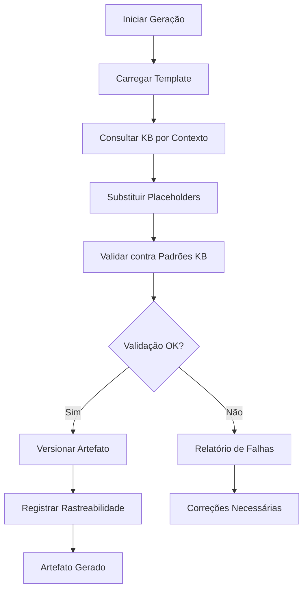

# Sistema de Artefatos Ricos - Fase 2.1: Templates e Estrutura

**Data**: 2025-09-24  
**Versão**: 1.0  
**Fase**: 2.1 - Templates e Estrutura do Sistema de Artefatos Ricos  
**Status**: 🏗️ EM IMPLEMENTAÇÃO

## 🎯 Objetivo

Implementar a infraestrutura completa de templates e estrutura para o Sistema de Artefatos Ricos, conforme especificado no plano de execução prioridade crítica.

## 📋 Entregáveis da Fase 2.1

### 1. Estrutura de Diretórios `artifacts/`

```
artifacts/
├── analyze/
│   ├── architecture_assessment.md
│   ├── technical_debt_report.md
│   ├── compliance_check.json
│   └── knowledge_base_references.md
├── architect/
│   ├── architecture_decision_records/
│   ├── system_design_document.md
│   ├── component_interaction_diagram.mmd
│   └── validation_reports/
├── implement/
│   ├── code_quality_report.json
│   ├── test_coverage_report.html
│   ├── performance_benchmarks.md
│   └── api_documentation.md
└── checkpoints/
    ├── quality_gate_results.json
    ├── compliance_audit.md
    └── rollback_snapshots/
```

### 2. Sistema de Versionamento

**Formato**: `{phase}.v{major}.{minor}_{timestamp}`

**Exemplos**:

- `analyze.v1.0_20250924T162500Z`
- `architect.v1.2_20250924T163000Z`
- `implement.v2.0_20250924T164500Z`

**Metadata**:

- `author`: Autor do artefato
- `kb_references`: Referências da Knowledge Base utilizadas
- `validation_status`: Status de validação (PASS/FAIL/PARTIAL)
- `dependencies`: Dependências de outros artefatos

### 3. Sistema de Rastreabilidade

**Decision Tracking**:

- Formato: `ADR-{phase}-{sequence}`
- Campos: [id, title, status, rationale, consequences]
- Links: [kb_reference, implementation_files]

**Change Tracking**:

- Diff generation: true
- Impact analysis: true
- Dependency mapping: true

## 🗂️ Templates de Artefatos (12 Templates)

### Fase ANALYZE (4 templates)

#### 1. Architecture Assessment Template

```yaml
template_id: "architecture_assessment"
phase: "analyze"
version: "1.0"
kb_integration: true
required_placeholders:
  - KB_REFERENCE
  - VALIDATION_RESULT
  - KB_CONTEXT
```

#### 2. Technical Debt Report Template

```yaml
template_id: "technical_debt_report"
phase: "analyze"
version: "1.0"
kb_integration: true
required_placeholders:
  - KB_REFERENCE
  - VALIDATION_RESULT
```

#### 3. Compliance Check Template

```yaml
template_id: "compliance_check"
phase: "analyze"
version: "1.0"
format: "json"
kb_integration: true
validation_rules:
  - shared_principles_compliance
  - context_appropriate_guidance
```

#### 4. Knowledge Base References Template

```yaml
template_id: "knowledge_base_references"
phase: "analyze"
version: "1.0"
kb_integration: true
auto_generated: true
```

### Fase ARCHITECT (4 templates)

#### 1. Architecture Decision Records Template

```yaml
template_id: "architecture_decision_records"
phase: "architect"
version: "1.0"
format: "directory_structure"
kb_integration: true
adr_format: "ADR-architect-{sequence}"
```

#### 2. System Design Document Template

```yaml
template_id: "system_design_document"
phase: "architect"
version: "1.0"
kb_integration: true
required_sections:
  - architecture_overview
  - component_design
  - data_flow
  - kb_compliance_section
```

#### 3. Component Interaction Diagram Template

```yaml
template_id: "component_interaction_diagram"
phase: "architect"
version: "1.0"
format: "mermaid"
kb_integration: true
auto_generated: true
```

#### 4. Validation Reports Template

```yaml
template_id: "validation_reports"
phase: "architect"
version: "1.0"
format: "directory_structure"
kb_integration: true
validation_types:
  - pattern_validation
  - dependency_validation
  - kb_compliance_validation
```

### Fase IMPLEMENT (4 templates)

#### 1. Code Quality Report Template

```yaml
template_id: "code_quality_report"
phase: "implement"
version: "1.0"
format: "json"
kb_integration: true
metrics:
  - code_quality_score
  - kb_pattern_compliance
  - technical_debt_ratio
```

#### 2. Test Coverage Report Template

```yaml
template_id: "test_coverage_report"
phase: "implement"
version: "1.0"
format: "html"
kb_integration: true
coverage_types:
  - unit_tests
  - integration_tests
  - kb_pattern_tests
```

#### 3. Performance Benchmarks Template

```yaml
template_id: "performance_benchmarks"
phase: "implement"
version: "1.0"
kb_integration: true
benchmark_categories:
  - response_times
  - throughput
  - resource_utilization
```

#### 4. API Documentation Template

```yaml
template_id: "api_documentation"
phase: "implement"
version: "1.0"
kb_integration: true
auto_generated: true
includes_kb_patterns: true
```

## 🔗 Integração com Sistema de Knowledge-Base

### Placeholders KB Obrigatórios

Todos os templates devem incluir os placeholders:

- `{KB_REFERENCE}`: Referências contextuais da Knowledge Base
- `{VALIDATION_RESULT}`: Resultados de validação de padrões
- `{KB_CONTEXT}`: Princípios aplicáveis por fase
- `{COMPLIANCE_REPORT_PATH}`: Caminho do relatório de conformidade

### Validação Automática

Cada template deve:

1. Consultar KB por contexto apropriado
2. Validar contra padrões KB
3. Gerar relatório de conformidade
4. Incluir referências KB no artefato final

### Contextos KB por Fase

- **analyze**: `shared-principles` + contextos detectados
- **architect**: `shared-principles` + `frontend/ui-architecture` + `backend/api-design`
- **implement**: `shared-principles` + `frontend/react-patterns` + `backend/domain-modeling`
- **checkpoints**: Todos os contextos para validação completa

## 🏗️ Arquitetura de Implementação

### Módulo de Geração de Artefatos

```bash
# Novo módulo: scripts/bash/artifact-generation.sh
generate_artifact(template_id, phase, context)
validate_artifact_against_kb(artifact_path, context)
version_artifact(artifact_path, phase)
track_artifact_dependencies(artifact_path)
```

### Fluxo de Geração



### Sistema de Versionamento

```bash
# Formato de versão
VERSION_FORMAT="{phase}.v{major}.{minor}_{timestamp}"

# Metadata do artefato
ARTIFACT_METADATA='{
  "version": "analyze.v1.0_20250924T162500Z",
  "author": "sdd-system",
  "kb_references": ["shared-principles/clean-code", "backend/domain-modeling"],
  "validation_status": "PASS",
  "dependencies": ["architecture_assessment.md"],
  "generated_at": "2025-09-24T16:25:00Z"
}'
```

## 📁 Estrutura de Arquivos a Implementar

### Templates de Artefatos

```
templates/artifacts/
├── analyze/
│   ├── architecture_assessment.template.md
│   ├── technical_debt_report.template.md
│   ├── compliance_check.template.json
│   └── knowledge_base_references.template.md
├── architect/
│   ├── architecture_decision_record.template.md
│   ├── system_design_document.template.md
│   ├── component_interaction_diagram.template.mmd
│   └── validation_report.template.md
├── implement/
│   ├── code_quality_report.template.json
│   ├── test_coverage_report.template.html
│   ├── performance_benchmarks.template.md
│   └── api_documentation.template.md
└── checkpoints/
    ├── quality_gate_results.template.json
    ├── compliance_audit.template.md
    └── rollback_snapshot.template.json
```

### Scripts de Geração

```
scripts/bash/
├── artifact-generation.sh          # Módulo principal
├── artifact-versioning.sh          # Sistema de versionamento
├── artifact-validation.sh          # Validação contra KB
└── artifact-traceability.sh        # Rastreabilidade

scripts/powershell/
├── artifact-generation.ps1         # Módulo principal
├── artifact-versioning.ps1         # Sistema de versionamento
├── artifact-validation.ps1         # Validação contra KB
└── artifact-traceability.ps1       # Rastreabilidade
```

## 🧪 Critérios de Aceitação

### Funcionais

- [ ] 12 templates de artefatos funcionais
- [ ] Estrutura de diretórios `artifacts/` implementada
- [ ] Sistema de versionamento semântico operacional
- [ ] Integração com Sistema de Knowledge-Base
- [ ] Templates geram artefatos válidos e estruturados

### Não-Funcionais

- [ ] Geração de artefatos < 10s por template
- [ ] Templates estruturados e legíveis
- [ ] Compatibilidade com sistema KB existente
- [ ] Documentação completa de uso

### Integração

- [ ] Placeholders KB funcionando em todos os templates
- [ ] Validação automática contra padrões KB
- [ ] Relatórios de conformidade gerados
- [ ] Rastreabilidade de decisões implementada

## 🚀 Próximos Passos

### Implementação Imediata (Modo Code)

1. **Criar estrutura de diretórios**:

   ```bash
   mkdir -p artifacts/{analyze,architect,implement,checkpoints}
   mkdir -p templates/artifacts/{analyze,architect,implement,checkpoints}
   ```

2. **Implementar templates de artefatos**:

   - 4 templates para fase `analyze/`
   - 4 templates para fase `architect/`
   - 4 templates para fase `implement/`

3. **Criar módulos de geração**:

   - `scripts/bash/artifact-generation.sh`
   - `scripts/powershell/artifact-generation.ps1`

4. **Implementar sistema de versionamento**:

   - Formato semântico + timestamp
   - Metadata de artefatos
   - Tracking de dependências

5. **Integrar com Sistema KB**:
   - Usar placeholders existentes
   - Validação automática
   - Relatórios de conformidade

### Validação e Testes

1. **Testar geração de artefatos**
2. **Validar integração KB**
3. **Verificar versionamento**
4. **Testar rastreabilidade**

## 📊 Status de Implementação

- [x] **Especificação completa** - Documentação técnica detalhada
- [ ] **Estrutura de diretórios** - Criação da estrutura `artifacts/`
- [ ] **Templates de artefatos** - 12 templates funcionais
- [ ] **Sistema de versionamento** - Implementação completa
- [ ] **Integração KB** - Placeholders e validação
- [ ] **Módulos de geração** - Scripts bash/powershell
- [ ] **Testes e validação** - Verificação completa

---

**Próxima Ação**: Solicitar mudança para modo **Code** para implementar a estrutura e templates especificados.

---

_Especificação técnica para implementação da Fase 2.1 do Sistema de Artefatos Ricos_  
_Parte de: SDD v2.0 Critical Systems Implementation_
