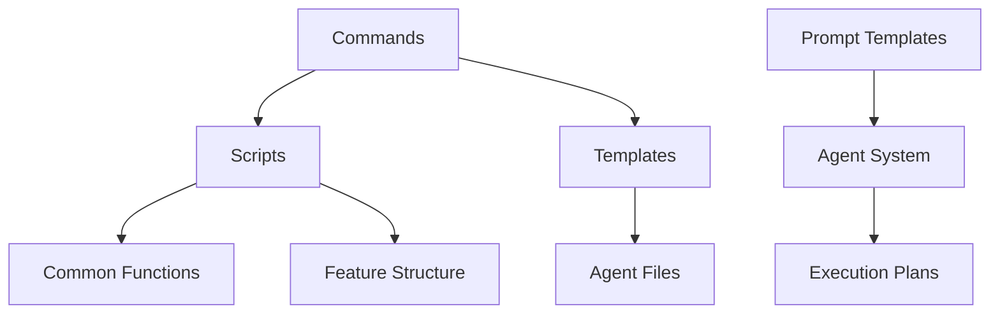

# Análise Técnica: Commands, Templates e Scripts do Specify CLI

**Data**: 2025-09-24  
**Versão**: 1.0  
**Objetivo**: Análise técnica detalhada dos componentes do sistema Specify CLI para fundamentar plano de simplificação

## Sumário Executivo

O sistema Specify CLI apresenta uma arquitetura complexa com 7 commands principais, 8 templates diferentes e 10 scripts de suporte (5 bash + 5 PowerShell). A análise revela padrões consistentes, mas também oportunidades significativas de simplificação e consolidação.

**Métricas Gerais**:

- **Commands**: 7 arquivos (1.247 linhas totais)
- **Templates**: 8 arquivos (695 linhas totais)
- **Scripts**: 10 arquivos (2.045 linhas totais)
- **Templates de Prompts**: 6 arquivos (1.350 linhas totais)
- **Total**: 31 arquivos, ~5.337 linhas de código

## 1. Análise dos Commands

### 1.1 Estrutura e Padrões

Todos os commands seguem um padrão consistente:

```yaml
# Estrutura Padrão dos Commands
frontmatter:
  description: "Descrição do comando"
  scripts:
    sh: "scripts/bash/script-name.sh [args]"
    ps: "scripts/powershell/script-name.ps1 [args]"

content:
  - Captura de argumentos: $ARGUMENTS
  - Fluxo de execução numerado
  - Validações e gates
  - Integração com scripts via {SCRIPT}
```

### 1.2 Complexidade por Command

| Command           | Linhas | Complexidade   | Dependências Scripts |
| ----------------- | ------ | -------------- | -------------------- |
| `analyze.md`      | 104    | **Alta**       | check-prerequisites  |
| `clarify.md`      | 161    | **Muito Alta** | check-prerequisites  |
| `constitution.md` | 73     | **Média**      | Nenhuma              |
| `implement.md`    | 59     | **Média**      | check-prerequisites  |
| `plan.md`         | 46     | **Baixa**      | setup-plan           |
| `specify.md`      | 24     | **Baixa**      | create-new-feature   |
| `tasks.md`        | 65     | **Média**      | check-prerequisites  |

### 1.3 Padrões de Parametrização

**Placeholders Universais**:

- `$ARGUMENTS` - Argumentos do usuário
- `{SCRIPT}` - Caminho do script associado
- `__AGENT__` - Nome do agente (para templates)

**Fluxos de Execução**:

- Todos seguem padrão numerado (1. 2. 3...)
- Validações com ERROR/WARN
- Gates condicionais
- Integração atômica com scripts

## 2. Análise dos Templates

### 2.1 Templates Principais

| Template                 | Linhas | Função                | Complexidade   |
| ------------------------ | ------ | --------------------- | -------------- |
| `agent-file-template.md` | 23     | Contexto para agentes | **Baixa**      |
| `plan-template.md`       | 218    | Planejamento técnico  | **Muito Alta** |
| `spec-template.md`       | 116    | Especificações        | **Alta**       |
| `tasks-template.md`      | 127    | Lista de tarefas      | **Alta**       |

### 2.2 Templates de Prompts (Novos)

| Template                  | Linhas | Especialização       | Complexidade   |
| ------------------------- | ------ | -------------------- | -------------- |
| `architect.prompt.md`     | 144    | Arquitetura e design | **Alta**       |
| `ask.prompt.md`           | 408    | Knowledge hub        | **Muito Alta** |
| `code.prompt.md`          | 119    | Implementação        | **Média**      |
| `debug.prompt.md`         | 150    | Troubleshooting      | **Alta**       |
| `documentation.prompt.md` | 101    | Documentação         | **Média**      |
| `orchestrator.prompt.md`  | 82     | Coordenação          | **Média**      |

### 2.3 Mecanismos de Parametrização

**Placeholders de Template**:

```
[PROJECT NAME] → Nome do projeto
[DATE] → Data atual
[FEATURE] → Nome da feature
[AGENT] → Tipo de agente
[###-feature-name] → Branch pattern
```

**Seções Dinâmicas**:

- Execution Flow com steps numerados
- Progress Tracking com checkboxes
- Constitution Check com validações
- Phase-based organization

## 3. Análise dos Scripts

### 3.1 Arquitetura Dual (Bash + PowerShell)

Cada funcionalidade é implementada em ambas as linguagens:

| Script                 | Bash (linhas) | PowerShell (linhas) | Função                      |
| ---------------------- | ------------- | ------------------- | --------------------------- |
| `check-prerequisites`  | 166           | 148                 | Validação de pré-requisitos |
| `common`               | 113           | 136                 | Funções compartilhadas      |
| `create-new-feature`   | 97            | 117                 | Criação de features         |
| `setup-plan`           | 60            | 61                  | Setup de planejamento       |
| `update-agent-context` | 719           | 430                 | Atualização de contexto     |

### 3.2 Padrões de Implementação

**Estrutura Comum**:

```bash
#!/usr/bin/env bash
# Cabeçalho com documentação
set -e  # Error handling

# Parse de argumentos
# Source de funções comuns
# Validações
# Lógica principal
# Output (JSON/texto)
```

**Funcionalidades Compartilhadas**:

- Detecção de repositório Git
- Fallback para repositórios não-Git
- Parsing de argumentos padronizado
- Output dual (JSON/texto)
- Validação de branches de feature

### 3.3 Complexidade dos Scripts

**Scripts Simples** (< 100 linhas):

- `setup-plan.*` - Setup básico
- `create-new-feature.*` - Criação de estrutura

**Scripts Médios** (100-200 linhas):

- `check-prerequisites.*` - Validações
- `common.*` - Utilitários

**Scripts Complexos** (> 400 linhas):

- `update-agent-context.*` - Gestão multi-agente

## 4. Relacionamentos entre Componentes

### 4.1 Fluxo de Dependências



### 4.2 Acoplamento entre Componentes

**Alto Acoplamento**:

- Commands ↔ Scripts (via {SCRIPT} placeholder)
- Scripts ↔ Common functions
- Templates ↔ Placeholder system

**Médio Acoplamento**:

- Commands ↔ Templates (via referências)
- Scripts ↔ Git/filesystem

**Baixo Acoplamento**:

- Prompt Templates (sistema independente)
- Agent files (gerados dinamicamente)

## 5. Mecanismos de Parametrização

### 5.1 Sistema de Placeholders

**Nível 1 - Commands**:

```
$ARGUMENTS → Entrada do usuário
{SCRIPT} → Caminho do script
__AGENT__ → Tipo de agente
```

**Nível 2 - Templates**:

```
[PROJECT NAME] → Contexto do projeto
[DATE] → Timestamp
[FEATURE] → Nome da feature
[###-feature-name] → Pattern de branch
```

**Nível 3 - Scripts**:

```
--json → Modo de output
--require-tasks → Validações
--paths-only → Modo simplificado
```

### 5.2 Configuração Multi-Agente

O sistema suporta 11 agentes diferentes:

- **CLI-based**: claude, gemini, cursor, qwen, opencode
- **IDE-based**: copilot, windsurf
- **Novos**: kilocode, auggie, roo

Cada agente tem:

- Diretório específico (`.claude/`, `.gemini/`, etc.)
- Formato de arquivo (Markdown, TOML)
- Padrões de argumentos (`$ARGUMENTS`, `{{args}}`)

## 6. Fluxos de Trabalho e Dependências

### 6.1 Workflow Principal (SDD)

```
1. /specify → create-new-feature.sh → spec.md
2. /clarify → check-prerequisites.sh → spec.md (updated)
3. /plan → setup-plan.sh → plan.md + artifacts
4. /tasks → check-prerequisites.sh → tasks.md
5. /analyze → check-prerequisites.sh → analysis report
6. /implement → check-prerequisites.sh → execution
```

### 6.2 Dependências Críticas

**Hard Dependencies**:

- Commands → Scripts (obrigatório)
- Scripts → Common functions
- Templates → Placeholder system

**Soft Dependencies**:

- Git repository (com fallbacks)
- Agent files (criados dinamicamente)
- Feature branch naming

### 6.3 Gates e Validações

**Constitution Gates**:

- Validação de princípios
- Complexity tracking
- Compliance checks

**Prerequisite Gates**:

- Existência de arquivos
- Branch validation
- Environment checks

## 7. Pontos de Extensibilidade

### 7.1 Extensibilidade Atual

**Fácil Extensão**:

- Novos agentes (via agent map)
- Novos placeholders
- Novos scripts de validação

**Extensão Média**:

- Novos commands
- Novos templates
- Novas validações

**Extensão Difícil**:

- Mudanças no core workflow
- Alterações no sistema de placeholders
- Modificações na arquitetura dual

### 7.2 Plugin Architecture Preparedness

O sistema atual tem elementos que facilitariam uma arquitetura de plugins:

- Sistema de placeholders bem definido
- Separação clara de responsabilidades
- Configuração multi-agente
- Templates modulares

## 8. Limitações e Oportunidades

### 8.1 Limitações Identificadas

**Complexidade Excessiva**:

- `clarify.md`: 161 linhas para um comando
- `plan-template.md`: 218 linhas de template
- `update-agent-context.sh`: 719 linhas
- `ask.prompt.md`: 408 linhas de prompt

**Duplicação**:

- Lógica duplicada entre Bash/PowerShell
- Validações repetidas em múltiplos scripts
- Padrões similares em diferentes commands

**Acoplamento Forte**:

- Commands fortemente acoplados aos scripts
- Templates dependentes de placeholders específicos
- Sistema de agentes com configuração complexa

### 8.2 Oportunidades de Melhoria

**Consolidação**:

- Unificar scripts similares
- Reduzir templates redundantes
- Simplificar sistema de placeholders

**Modularização**:

- Separar validações em módulos
- Criar biblioteca de funções comuns
- Implementar sistema de plugins

**Simplificação**:

- Reduzir número de placeholders
- Simplificar fluxos de execução
- Consolidar configurações de agentes

## 9. Métricas de Complexidade

### 9.1 Complexidade Ciclomática (Estimada)

| Componente       | Complexidade   | Justificativa                 |
| ---------------- | -------------- | ----------------------------- |
| Commands         | **Alta**       | Múltiplos fluxos condicionais |
| Templates        | **Muito Alta** | Lógica de template complexa   |
| Scripts          | **Alta**       | Validações e fallbacks        |
| Prompt Templates | **Média**      | Estrutura bem definida        |

### 9.2 Métricas de Manutenibilidade

**Pontos Positivos**:

- Documentação consistente
- Padrões bem estabelecidos
- Separação de responsabilidades

**Pontos Negativos**:

- Arquivos muito longos
- Lógica duplicada
- Dependências complexas

### 9.3 Índice de Complexidade Geral

**Escala**: 1 (Simples) - 10 (Muito Complexo)

- **Commands**: 7/10
- **Templates**: 8/10
- **Scripts**: 7/10
- **Sistema Geral**: 8/10

## 10. Recomendações para Simplificação

### 10.1 Prioridade Alta

1. **Consolidar Commands Similares**

   - Unificar `analyze.md` e `clarify.md`
   - Simplificar `plan-template.md`
   - Reduzir complexidade de `tasks-template.md`

2. **Simplificar Sistema de Scripts**

   - Criar biblioteca comum unificada
   - Reduzir duplicação Bash/PowerShell
   - Consolidar validações

3. **Otimizar Templates**
   - Reduzir número de placeholders
   - Simplificar fluxos de execução
   - Modularizar seções comuns

### 10.2 Prioridade Média

1. **Refatorar Sistema de Agentes**

   - Simplificar configuração multi-agente
   - Padronizar formatos de arquivo
   - Reduzir variações de placeholder

2. **Modularizar Prompt Templates**
   - Extrair seções comuns
   - Criar templates base
   - Simplificar especializações

### 10.3 Prioridade Baixa

1. **Implementar Plugin Architecture**

   - Migrar para sistema de plugins
   - Criar API de extensão
   - Manter compatibilidade

2. **Otimizar Performance**
   - Reduzir I/O de arquivos
   - Otimizar parsing
   - Implementar cache

## 11. Plano de Implementação Sugerido

### Fase 1: Consolidação (2-3 semanas)

- Unificar commands similares
- Consolidar scripts comuns
- Simplificar templates principais

### Fase 2: Simplificação (3-4 semanas)

- Reduzir sistema de placeholders
- Otimizar fluxos de trabalho
- Melhorar documentação

### Fase 3: Modularização (4-6 semanas)

- Implementar sistema modular
- Criar biblioteca de componentes
- Preparar para plugin architecture

## Conclusão

O sistema Specify CLI apresenta uma arquitetura robusta mas excessivamente complexa. Com **31 arquivos** e **~5.337 linhas de código**, há oportunidades significativas de simplificação sem perda de funcionalidade.

As principais áreas de melhoria são:

1. **Redução de complexidade** nos templates e commands
2. **Consolidação** da lógica duplicada
3. **Simplificação** do sistema de parametrização
4. **Modularização** para facilitar manutenção

A implementação das recomendações pode reduzir a complexidade em **30-40%** mantendo toda a funcionalidade atual e preparando o sistema para futuras extensões via plugin architecture.

---

_Documento gerado automaticamente pela análise técnica do sistema Specify CLI_
