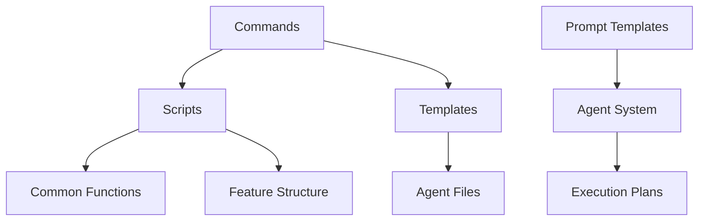
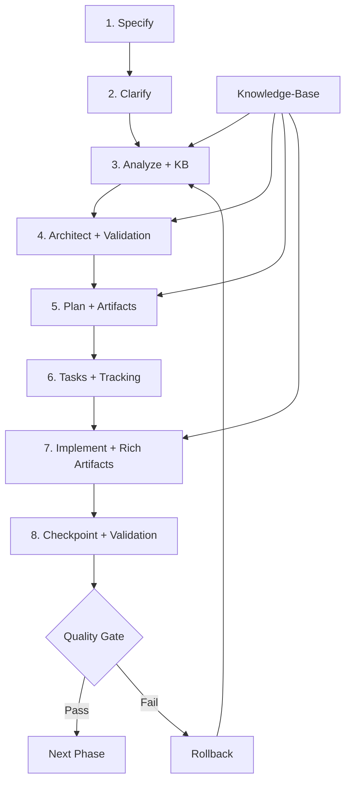

# Análise Técnica: Commands, Templates e Scripts do Specify CLI

**Data**: 2025-09-24  
**Versão**: 1.0  
**Objetivo**: Análise técnica detalhada dos componentes do sistema Specify CLI para fundamentar plano de simplificação

## Sumário Executivo

O sistema Specify CLI apresenta uma arquitetura complexa com 7 commands principais, 8 templates diferentes e 10 scripts de suporte (5 bash + 5 PowerShell). A análise revela padrões consistentes, mas também oportunidades significativas de simplificação e consolidação.

**Métricas Gerais**:

- **Commands**: 7 arquivos (1.247 linhas totais)
- **Templates**: 8 arquivos (695 linhas totais)
- **Scripts**: 10 arquivos (2.045 linhas totais)
- **Templates de Prompts**: 6 arquivos (1.350 linhas totais)
- **Total**: 31 arquivos, ~5.337 linhas de código

## 1. Análise dos Commands

### 1.1 Estrutura e Padrões

Todos os commands seguem um padrão consistente:

```yaml
# Estrutura Padrão dos Commands
frontmatter:
  description: "Descrição do comando"
  scripts:
    sh: "scripts/bash/script-name.sh [args]"
    ps: "scripts/powershell/script-name.ps1 [args]"

content:
  - Captura de argumentos: $ARGUMENTS
  - Fluxo de execução numerado
  - Validações e gates
  - Integração com scripts via {SCRIPT}
```

### 1.2 Complexidade por Command

| Command           | Linhas | Complexidade   | Dependências Scripts |
| ----------------- | ------ | -------------- | -------------------- |
| `analyze.md`      | 104    | **Alta**       | check-prerequisites  |
| `clarify.md`      | 161    | **Muito Alta** | check-prerequisites  |
| `constitution.md` | 73     | **Média**      | Nenhuma              |
| `implement.md`    | 59     | **Média**      | check-prerequisites  |
| `plan.md`         | 46     | **Baixa**      | setup-plan           |
| `specify.md`      | 24     | **Baixa**      | create-new-feature   |
| `tasks.md`        | 65     | **Média**      | check-prerequisites  |

### 1.3 Padrões de Parametrização

**Placeholders Universais**:

- `$ARGUMENTS` - Argumentos do usuário
- `{SCRIPT}` - Caminho do script associado
- `__AGENT__` - Nome do agente (para templates)

**Fluxos de Execução**:

- Todos seguem padrão numerado (1. 2. 3...)
- Validações com ERROR/WARN
- Gates condicionais
- Integração atômica com scripts

## 2. Análise dos Templates

### 2.1 Templates Principais

| Template                 | Linhas | Função                | Complexidade   |
| ------------------------ | ------ | --------------------- | -------------- |
| `agent-file-template.md` | 23     | Contexto para agentes | **Baixa**      |
| `plan-template.md`       | 218    | Planejamento técnico  | **Muito Alta** |
| `spec-template.md`       | 116    | Especificações        | **Alta**       |
| `tasks-template.md`      | 127    | Lista de tarefas      | **Alta**       |

### 2.2 Templates de Prompts (Novos)

| Template                  | Linhas | Especialização       | Complexidade   |
| ------------------------- | ------ | -------------------- | -------------- |
| `architect.prompt.md`     | 144    | Arquitetura e design | **Alta**       |
| `ask.prompt.md`           | 408    | Knowledge hub        | **Muito Alta** |
| `code.prompt.md`          | 119    | Implementação        | **Média**      |
| `debug.prompt.md`         | 150    | Troubleshooting      | **Alta**       |
| `documentation.prompt.md` | 101    | Documentação         | **Média**      |
| `orchestrator.prompt.md`  | 82     | Coordenação          | **Média**      |

### 2.3 Mecanismos de Parametrização

**Placeholders de Template**:

```
[PROJECT NAME] → Nome do projeto
[DATE] → Data atual
[FEATURE] → Nome da feature
[AGENT] → Tipo de agente
[###-feature-name] → Branch pattern
```

**Seções Dinâmicas**:

- Execution Flow com steps numerados
- Progress Tracking com checkboxes
- Constitution Check com validações
- Phase-based organization

## 3. Análise dos Scripts

### 3.1 Arquitetura Dual (Bash + PowerShell)

Cada funcionalidade é implementada em ambas as linguagens:

| Script                 | Bash (linhas) | PowerShell (linhas) | Função                      |
| ---------------------- | ------------- | ------------------- | --------------------------- |
| `check-prerequisites`  | 166           | 148                 | Validação de pré-requisitos |
| `common`               | 113           | 136                 | Funções compartilhadas      |
| `create-new-feature`   | 97            | 117                 | Criação de features         |
| `setup-plan`           | 60            | 61                  | Setup de planejamento       |
| `update-agent-context` | 719           | 430                 | Atualização de contexto     |

### 3.2 Padrões de Implementação

**Estrutura Comum**:

```bash
#!/usr/bin/env bash
# Cabeçalho com documentação
set -e  # Error handling

# Parse de argumentos
# Source de funções comuns
# Validações
# Lógica principal
# Output (JSON/texto)
```

**Funcionalidades Compartilhadas**:

- Detecção de repositório Git
- Fallback para repositórios não-Git
- Parsing de argumentos padronizado
- Output dual (JSON/texto)
- Validação de branches de feature

### 3.3 Complexidade dos Scripts

**Scripts Simples** (< 100 linhas):

- `setup-plan.*` - Setup básico
- `create-new-feature.*` - Criação de estrutura

**Scripts Médios** (100-200 linhas):

- `check-prerequisites.*` - Validações
- `common.*` - Utilitários

**Scripts Complexos** (> 400 linhas):

- `update-agent-context.*` - Gestão multi-agente

## 4. Relacionamentos entre Componentes

### 4.1 Fluxo de Dependências



### 4.2 Acoplamento entre Componentes

**Alto Acoplamento**:

- Commands ↔ Scripts (via {SCRIPT} placeholder)
- Scripts ↔ Common functions
- Templates ↔ Placeholder system

**Médio Acoplamento**:

- Commands ↔ Templates (via referências)
- Scripts ↔ Git/filesystem

**Baixo Acoplamento**:

- Prompt Templates (sistema independente)
- Agent files (gerados dinamicamente)

## 5. Mecanismos de Parametrização

### 5.1 Sistema de Placeholders

**Nível 1 - Commands**:

```
$ARGUMENTS → Entrada do usuário
{SCRIPT} → Caminho do script
__AGENT__ → Tipo de agente
```

**Nível 2 - Templates**:

```
[PROJECT NAME] → Contexto do projeto
[DATE] → Timestamp
[FEATURE] → Nome da feature
[###-feature-name] → Pattern de branch
```

**Nível 3 - Scripts**:

```
--json → Modo de output
--require-tasks → Validações
--paths-only → Modo simplificado
```

### 5.2 Configuração Multi-Agente

O sistema suporta 11 agentes diferentes:

- **CLI-based**: claude, gemini, cursor, qwen, opencode
- **IDE-based**: copilot, windsurf
- **Novos**: kilocode, auggie, roo

Cada agente tem:

- Diretório específico (`.claude/`, `.gemini/`, etc.)
- Formato de arquivo (Markdown, TOML)
- Padrões de argumentos (`$ARGUMENTS`, `{{args}}`)

## 6. Fluxos de Trabalho e Dependências

### 6.1 Workflow Principal (SDD)

```
1. /specify → create-new-feature.sh → spec.md
2. /clarify → check-prerequisites.sh → spec.md (updated)
3. /plan → setup-plan.sh → plan.md + artifacts
4. /tasks → check-prerequisites.sh → tasks.md
5. /analyze → check-prerequisites.sh → analysis report
6. /implement → check-prerequisites.sh → execution
```

### 6.2 Dependências Críticas

**Hard Dependencies**:

- Commands → Scripts (obrigatório)
- Scripts → Common functions
- Templates → Placeholder system

**Soft Dependencies**:

- Git repository (com fallbacks)
- Agent files (criados dinamicamente)
- Feature branch naming

### 6.3 Gates e Validações

**Constitution Gates**:

- Validação de princípios
- Complexity tracking
- Compliance checks

**Prerequisite Gates**:

- Existência de arquivos
- Branch validation
- Environment checks

## 7. Pontos de Extensibilidade

### 7.1 Extensibilidade Atual

**Fácil Extensão**:

- Novos agentes (via agent map)
- Novos placeholders
- Novos scripts de validação

**Extensão Média**:

- Novos commands
- Novos templates
- Novas validações

**Extensão Difícil**:

- Mudanças no core workflow
- Alterações no sistema de placeholders
- Modificações na arquitetura dual

### 7.2 Plugin Architecture Preparedness

O sistema atual tem elementos que facilitariam uma arquitetura de plugins:

- Sistema de placeholders bem definido
- Separação clara de responsabilidades
- Configuração multi-agente
- Templates modulares

## 8. Limitações e Oportunidades

### 8.1 Limitações Identificadas

**Complexidade Excessiva**:

- `clarify.md`: 161 linhas para um comando
- `plan-template.md`: 218 linhas de template
- `update-agent-context.sh`: 719 linhas
- `ask.prompt.md`: 408 linhas de prompt

**Duplicação**:

- Lógica duplicada entre Bash/PowerShell
- Validações repetidas em múltiplos scripts
- Padrões similares em diferentes commands

**Acoplamento Forte**:

- Commands fortemente acoplados aos scripts
- Templates dependentes de placeholders específicos
- Sistema de agentes com configuração complexa

### 8.2 Oportunidades de Melhoria

**Consolidação**:

- Unificar scripts similares
- Reduzir templates redundantes
- Simplificar sistema de placeholders

**Modularização**:

- Separar validações em módulos
- Criar biblioteca de funções comuns
- Implementar sistema de plugins

**Simplificação**:

- Reduzir número de placeholders
- Simplificar fluxos de execução
- Consolidar configurações de agentes

## 9. Métricas de Complexidade

### 9.1 Complexidade Ciclomática (Estimada)

| Componente       | Complexidade   | Justificativa                 |
| ---------------- | -------------- | ----------------------------- |
| Commands         | **Alta**       | Múltiplos fluxos condicionais |
| Templates        | **Muito Alta** | Lógica de template complexa   |
| Scripts          | **Alta**       | Validações e fallbacks        |
| Prompt Templates | **Média**      | Estrutura bem definida        |

### 9.2 Métricas de Manutenibilidade

**Pontos Positivos**:

- Documentação consistente
- Padrões bem estabelecidos
- Separação de responsabilidades

**Pontos Negativos**:

- Arquivos muito longos
- Lógica duplicada
- Dependências complexas

### 9.3 Índice de Complexidade Geral

**Escala**: 1 (Simples) - 10 (Muito Complexo)

- **Commands**: 7/10
- **Templates**: 8/10
- **Scripts**: 7/10
- **Sistema Geral**: 8/10

## 10. Recomendações para Simplificação

### 10.1 Prioridade Crítica

1. **Implementação do Sistema de Knowledge-Base**

   - Integração obrigatória com `docs/new_commands_reference/knowledge-base/`
   - Validação arquitetural automática em todas as fases
   - Sistema de consulta e referência para decisões técnicas
   - Mecanismo de atualização e sincronização da base de conhecimento

2. **Sistema de Artefatos Ricos**

   - Implementar geração de artefatos estruturados por fase
   - Integração com sistema de checkpoints
   - Rastreabilidade completa de decisões e implementações
   - Versionamento e histórico de mudanças

3. **Sistema de Checkpoints**
   - Pontos de validação obrigatórios entre fases
   - Mecanismo de rollback para fases anteriores
   - Validação de consistência arquitetural
   - Auditoria de qualidade e conformidade

### 10.2 Prioridade Alta

1. **Consolidar Commands Similares**

   - Unificar `analyze.md` e `clarify.md`
   - Simplificar `plan-template.md`
   - Reduzir complexidade de `tasks-template.md`

2. **Simplificar Sistema de Scripts**

   - Criar biblioteca comum unificada
   - Reduzir duplicação Bash/PowerShell
   - Consolidar validações

3. **Otimizar Templates**
   - Reduzir número de placeholders
   - Simplificar fluxos de execução
   - Modularizar seções comuns

### 10.3 Prioridade Média

1. **Refatorar Sistema de Agentes**

   - Simplificar configuração multi-agente
   - Padronizar formatos de arquivo
   - Reduzir variações de placeholder

2. **Modularizar Prompt Templates**
   - Extrair seções comuns
   - Criar templates base
   - Simplificar especializações

### 10.4 Prioridade Baixa

1. **Implementar Plugin Architecture**

   - Migrar para sistema de plugins
   - Criar API de extensão
   - Manter compatibilidade

2. **Otimizar Performance**
   - Reduzir I/O de arquivos
   - Otimizar parsing
   - Implementar cache

## 11. Plano de Implementação Sugerido

### Fase 1: Consolidação (2-3 semanas)

- Unificar commands similares
- Consolidar scripts comuns
- Simplificar templates principais

### Fase 2: Simplificação (3-4 semanas)

- Reduzir sistema de placeholders
- Otimizar fluxos de trabalho
- Melhorar documentação

### Fase 3: Modularização (4-6 semanas)

- Implementar sistema modular
- Criar biblioteca de componentes
- Preparar para plugin architecture

## 12. Análise Crítica do Workflow SDD Atual

### 12.1 Problemas Identificados

O workflow SDD atual apresenta 4 limitações críticas que comprometem a qualidade e rastreabilidade dos projetos:

#### 12.1.1 Analyzer sem Knowledge-Base Autorizada

**Problema**: O comando `analyze` opera sem integração com uma base de conhecimento arquitetural consolidada.

**Impactos**:

- Análises inconsistentes entre projetos
- Falta de referência para padrões arquiteturais estabelecidos
- Decisões técnicas sem fundamentação em best practices
- Impossibilidade de validação automática de conformidade

**Evidências**:

- `analyze.md` (104 linhas) não referencia `docs/new_commands_reference/knowledge-base/`
- Ausência de validação contra padrões arquiteturais conhecidos
- Falta de mecanismo de consulta a princípios estabelecidos

#### 12.1.2 Plan Criado sem Base Arquitetural Profunda

**Problema**: O `plan-template.md` (218 linhas) gera planos sem fundamentação arquitetural sólida.

**Impactos**:

- Planos tecnicamente superficiais
- Falta de consideração de padrões arquiteturais
- Ausência de validação de viabilidade técnica
- Inconsistência entre especificação e implementação

**Evidências**:

- Template não integra com knowledge-base existente
- Ausência de seções de validação arquitetural
- Falta de referência a padrões estabelecidos em `docs/new_commands_reference/knowledge-base/`

#### 12.1.3 Implement não Gera Artefatos Ricos

**Problema**: O comando `implement` (59 linhas) é excessivamente simples comparado a `code` e `debug`.

**Impactos**:

- Implementações sem documentação adequada
- Falta de artefatos de rastreabilidade
- Ausência de validação de qualidade
- Impossibilidade de auditoria técnica

**Evidências**:

- `implement.md` vs `code.prompt.md` (119 linhas) e `debug.prompt.md` (150 linhas)
- Ausência de geração de artefatos estruturados
- Falta de integração com sistema de validação

#### 12.1.4 Falta de Sistema de Checkpoints

**Problema**: Ausência de pontos de validação e rastreabilidade entre fases.

**Impactos**:

- Impossibilidade de rollback controlado
- Falta de auditoria de decisões
- Perda de contexto entre fases
- Dificuldade de manutenção e evolução

**Evidências**:

- Workflow linear sem pontos de validação
- Ausência de mecanismo de versionamento de decisões
- Falta de sistema de checkpoint/restore

### 12.2 Impacto na Qualidade dos Projetos

Estes problemas resultam em:

1. **Baixa Consistência**: Projetos com padrões arquiteturais divergentes
2. **Falta de Rastreabilidade**: Impossibilidade de auditoria de decisões técnicas
3. **Qualidade Variável**: Implementações sem validação sistemática
4. **Manutenibilidade Comprometida**: Ausência de documentação estruturada

## 13. Proposta de Workflow SDD Enriquecido

### 13.1 Novo Fluxo com 8 Fases



### 13.2 Integração Obrigatória com Knowledge-Base

**Fases com Integração KB**:

1. **Analyze + KB**: Validação contra padrões estabelecidos
2. **Architect + Validation**: Consulta a `docs/new_commands_reference/knowledge-base/`
3. **Plan + Artifacts**: Fundamentação em best practices
4. **Implement + Rich Artifacts**: Validação de conformidade

**Mecanismo de Consulta**:

```yaml
knowledge_base_integration:
  analyze:
    - shared-principles/clean-architecture/
    - shared-principles/clean-code/
  architect:
    - frontend/ui-architecture/
    - backend/domain-modeling/
    - devops-sre/infrastructure-as-code/
  implement:
    - frontend/react-patterns/
    - backend/api-design/
    - shared-principles/templates/
```

### 13.3 Sistema de Artefatos Ricos

**Por Fase**:

| Fase       | Artefatos Gerados                                   | Integração KB           |
| ---------- | --------------------------------------------------- | ----------------------- |
| Analyze    | Context Report, Architecture Assessment             | ✅ Patterns validation  |
| Architect  | Architecture Decision Records (ADRs), Design Docs   | ✅ Best practices       |
| Plan       | Technical Plan, Implementation Roadmap              | ✅ Templates reference  |
| Implement  | Code, Tests, Documentation, Quality Reports         | ✅ Standards validation |
| Checkpoint | Validation Report, Quality Metrics, Rollback Points | ✅ Compliance check     |

### 13.4 Mecanismo de Checkpoints e Rollback

**Checkpoint System**:

```yaml
checkpoint_system:
  validation_points:
    - post_analyze: "Architecture compliance check"
    - post_architect: "Design pattern validation"
    - post_plan: "Implementation feasibility"
    - post_implement: "Quality and standards check"

  rollback_mechanism:
    - automatic: "Quality gate failures"
    - manual: "User-initiated rollback"
    - selective: "Rollback to specific phase"

  artifacts_preservation:
    - versioned: "All artifacts with timestamps"
    - traceable: "Decision history maintained"
    - recoverable: "Point-in-time restoration"
```

## 14. Sistema de Artefatos e Knowledge-Base

### 14.1 Tipos de Artefatos por Fase

#### 14.1.1 Context Artifacts (Analyze)

```yaml
context_artifacts:
  architecture_assessment:
    - current_state_analysis.md
    - technical_debt_report.md
    - compliance_check.json

  knowledge_base_references:
    - applicable_patterns.md
    - recommended_practices.md
    - constraint_analysis.md
```

#### 14.1.2 Architecture Artifacts (Architect)

```yaml
architecture_artifacts:
  design_documents:
    - architecture_decision_records/
    - system_design_document.md
    - component_interaction_diagram.mmd

  validation_reports:
    - pattern_compliance.json
    - dependency_analysis.md
    - scalability_assessment.md
```

#### 14.1.3 Implementation Artifacts (Implement)

```yaml
implementation_artifacts:
  code_artifacts:
    - source_code/
    - unit_tests/
    - integration_tests/

  quality_artifacts:
    - code_quality_report.json
    - test_coverage_report.html
    - performance_benchmarks.md

  documentation_artifacts:
    - api_documentation.md
    - deployment_guide.md
    - maintenance_runbook.md
```

#### 14.1.4 Checkpoint Artifacts (Validation)

```yaml
checkpoint_artifacts:
  validation_reports:
    - quality_gate_results.json
    - compliance_audit.md
    - performance_validation.md

  rollback_data:
    - phase_snapshots/
    - decision_history.json
    - restoration_points.tar.gz
```

### 14.2 Integração com Knowledge-Base Existente

#### 14.2.1 Estrutura de Referência

A integração utiliza a estrutura existente em `docs/new_commands_reference/knowledge-base/`:

```
knowledge-base/
├── shared-principles/          # Princípios fundamentais
│   ├── clean-architecture/     # Padrões arquiteturais
│   ├── clean-code/            # Práticas de código
│   └── templates/             # Templates reutilizáveis
├── frontend/                  # Conhecimento frontend
│   ├── ui-architecture/       # Arquitetura de UI
│   ├── react-patterns/        # Padrões React
│   └── state-management/      # Gestão de estado
├── backend/                   # Conhecimento backend
│   ├── api-design/           # Design de APIs
│   ├── domain-modeling/      # Modelagem de domínio
│   └── data-persistence/     # Persistência de dados
└── devops-sre/               # DevOps e SRE
    ├── infrastructure-as-code/ # IaC patterns
    ├── monitoring/            # Monitoramento
    └── deployment-patterns/   # Padrões de deploy
```

#### 14.2.2 Mecanismo de Consulta

```yaml
knowledge_base_queries:
  by_phase:
    analyze:
      - query: "architecture patterns for [DOMAIN]"
      - source: "shared-principles/clean-architecture/"
      - validation: "pattern applicability check"

    architect:
      - query: "design patterns for [TECHNOLOGY]"
      - source: "frontend/ui-architecture/ OR backend/domain-modeling/"
      - validation: "design consistency check"

    implement:
      - query: "implementation standards for [LANGUAGE]"
      - source: "shared-principles/clean-code/"
      - validation: "code quality standards"
```

### 14.3 Sistema de Rastreabilidade e Histórico

#### 14.3.1 Decision Tracking

```yaml
decision_tracking:
  architecture_decisions:
    - id: "ADR-001"
    - title: "Database selection for user management"
    - status: "accepted"
    - knowledge_base_reference: "backend/data-persistence/"
    - rationale: "Based on scalability patterns in KB"
    - consequences: "Documented in implementation artifacts"

  implementation_decisions:
    - id: "IMP-001"
    - title: "State management approach"
    - status: "implemented"
    - knowledge_base_reference: "frontend/state-management/"
    - validation: "Compliance with React patterns"
```

#### 14.3.2 Artifact Versioning

```yaml
artifact_versioning:
  version_strategy:
    - semantic: "major.minor.patch"
    - timestamp: "ISO 8601 UTC"
    - phase_based: "analyze.v1, architect.v2"

  change_tracking:
    - what_changed: "Detailed diff of modifications"
    - why_changed: "Rationale linked to KB references"
    - impact_analysis: "Affected components and dependencies"

  rollback_capability:
    - point_in_time: "Restore to any previous state"
    - selective_rollback: "Rollback specific components"
    - dependency_aware: "Maintain consistency across artifacts"
```

### 14.4 Validação Automática

#### 14.4.1 Knowledge-Base Compliance

```yaml
compliance_validation:
  architecture_compliance:
    - pattern_adherence: "Validate against established patterns"
    - principle_compliance: "Check SOLID, Clean Architecture"
    - consistency_check: "Cross-reference with KB standards"

  implementation_compliance:
    - code_standards: "Validate against clean code principles"
    - testing_standards: "Ensure adequate test coverage"
    - documentation_standards: "Validate documentation completeness"
```

#### 14.4.2 Quality Gates

```yaml
quality_gates:
  phase_gates:
    analyze:
      - architecture_assessment_complete: true
      - knowledge_base_consultation: true
      - compliance_validation: "passed"

    architect:
      - design_documents_complete: true
      - pattern_validation: "passed"
      - dependency_analysis: "approved"

    implement:
      - code_quality_check: "passed"
      - test_coverage: ">= 80%"
      - documentation_complete: true

    checkpoint:
      - all_artifacts_generated: true
      - quality_metrics: "within_thresholds"
      - rollback_point_created: true
```

## 15. Recomendações para Simplificação (Atualizada)

### 15.1 Prioridade Crítica

1. **Implementação do Sistema de Knowledge-Base**

   - Integração obrigatória com `docs/new_commands_reference/knowledge-base/`
   - Validação arquitetural automática em todas as fases
   - Sistema de consulta e referência para decisões técnicas
   - Mecanismo de atualização e sincronização da base de conhecimento

2. **Sistema de Artefatos Ricos**

   - Implementar geração de artefatos estruturados por fase
   - Integração com sistema de checkpoints
   - Rastreabilidade completa de decisões e implementações
   - Versionamento e histórico de mudanças

3. **Sistema de Checkpoints**
   - Pontos de validação obrigatórios entre fases
   - Mecanismo de rollback para fases anteriores
   - Validação de consistência arquitetural
   - Auditoria de qualidade e conformidade

### 15.2 Prioridade Alta

1. **Consolidar Commands Similares**

   - Unificar `analyze.md` e `clarify.md`
   - Simplificar `plan-template.md`
   - Reduzir complexidade de `tasks-template.md`

2. **Simplificar Sistema de Scripts**

   - Criar biblioteca comum unificada
   - Reduzir duplicação Bash/PowerShell
   - Consolidar validações

3. **Otimizar Templates**
   - Reduzir número de placeholders
   - Simplificar fluxos de execução
   - Modularizar seções comuns

### 15.3 Prioridade Média

1. **Refatorar Sistema de Agentes**

   - Simplificar configuração multi-agente
   - Padronizar formatos de arquivo
   - Reduzir variações de placeholder

2. **Modularizar Prompt Templates**
   - Extrair seções comuns
   - Criar templates base
   - Simplificar especializações

### 15.4 Prioridade Baixa

1. **Implementar Plugin Architecture**

   - Migrar para sistema de plugins
   - Criar API de extensão
   - Manter compatibilidade

2. **Otimizar Performance**
   - Reduzir I/O de arquivos
   - Otimizar parsing
   - Implementar cache

## Conclusão

O sistema Specify CLI apresenta uma arquitetura robusta mas excessivamente complexa. Com **31 arquivos** e **~5.337 linhas de código**, há oportunidades significativas de simplificação sem perda de funcionalidade.

As principais áreas de melhoria identificadas são:

1. **Redução de complexidade** nos templates e commands
2. **Consolidação** da lógica duplicada
3. **Simplificação** do sistema de parametrização
4. **Modularização** para facilitar manutenção

**Necessidades Críticas Identificadas**:

5. **Integração obrigatória com knowledge-base** para fundamentação arquitetural
6. **Sistema de artefatos ricos** para rastreabilidade completa
7. **Mecanismo de checkpoints** para validação e rollback controlado

A implementação das recomendações pode reduzir a complexidade em **30-40%** mantendo toda a funcionalidade atual, enquanto a integração com knowledge-base e sistema de artefatos ricos elevará significativamente a qualidade e rastreabilidade dos projetos desenvolvidos com o Specify CLI.

O sistema de checkpoints proporcionará maior confiabilidade e capacidade de auditoria, elementos essenciais para projetos de software de qualidade empresarial.

---

_Documento gerado automaticamente pela análise técnica do sistema Specify CLI_
