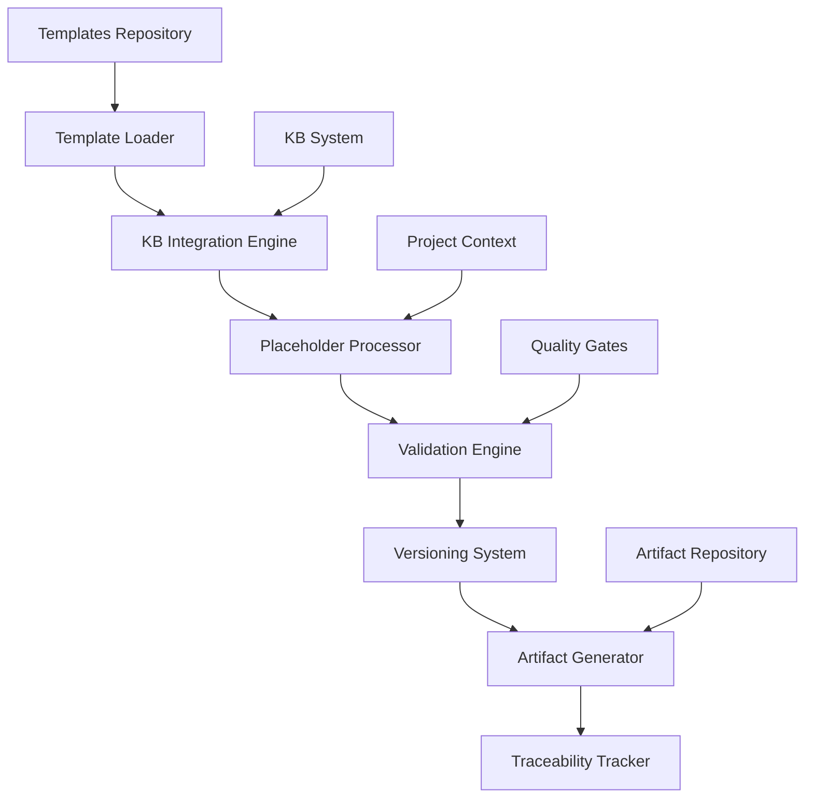
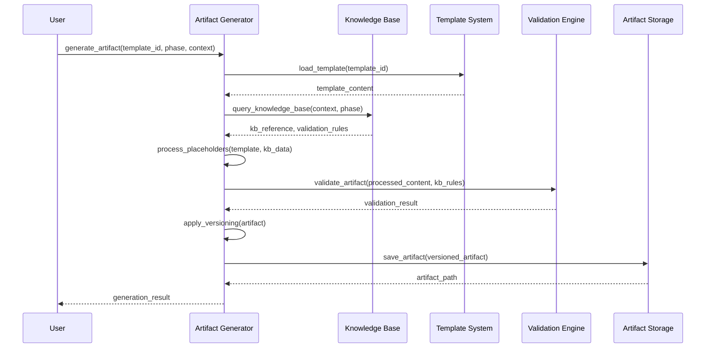

# Módulo de Geração Automática de Artefatos - Especificação

**Data**: 2025-09-24  
**Versão**: 1.0  
**Módulo**: Artifact Generation System  
**Integração KB**: ✅ Obrigatória

## 🎯 Visão Geral

Esta documentação especifica o **Módulo de Geração Automática de Artefatos** que será responsável por processar os templates, integrar com o Sistema de Knowledge-Base, aplicar versionamento semântico e gerar artefatos estruturados.

## 🏗️ Arquitetura do Módulo

### Componentes Principais



### Fluxo de Geração



## 📁 Estrutura de Arquivos

### Scripts Principais

```
scripts/bash/
├── artifact-generation.sh          # Módulo principal de geração
├── artifact-versioning.sh          # Sistema de versionamento
├── artifact-validation.sh          # Validação contra KB
├── artifact-traceability.sh        # Rastreabilidade de artefatos
└── artifact-templates.sh           # Gerenciamento de templates

scripts/powershell/
├── artifact-generation.ps1         # Módulo principal de geração
├── artifact-versioning.ps1         # Sistema de versionamento
├── artifact-validation.ps1         # Validação contra KB
├── artifact-traceability.ps1       # Rastreabilidade de artefatos
└── artifact-templates.ps1          # Gerenciamento de templates
```

### Templates Repository

```
templates/artifacts/
├── analyze/
│   ├── architecture_assessment.template.md
│   ├── technical_debt_report.template.md
│   ├── compliance_check.template.json
│   └── knowledge_base_references.template.md
├── architect/
│   ├── architecture_decision_record.template.md
│   ├── system_design_document.template.md
│   ├── component_interaction_diagram.template.mmd
│   └── validation_report.template.md
├── implement/
│   ├── code_quality_report.template.json
│   ├── test_coverage_report.template.html
│   ├── performance_benchmarks.template.md
│   └── api_documentation.template.md
└── checkpoints/
    ├── quality_gate_results.template.json
    ├── compliance_audit.template.md
    ├── rollback_snapshot.template.json
    └── checkpoint_summary.template.md
```

## 🔧 Especificação Técnica

### 1. Módulo Principal - artifact-generation.sh

```bash
#!/usr/bin/env bash
# Artifact Generation Module
# Generates rich artifacts with KB integration and versioning
# Part of SDD v2.0 Critical Systems Implementation

# Source dependencies
SCRIPT_DIR="$(cd "$(dirname "${BASH_SOURCE[0]}")" && pwd)"
source "$SCRIPT_DIR/common.sh"
source "$SCRIPT_DIR/knowledge-base-integration.sh"
source "$SCRIPT_DIR/artifact-versioning.sh"
source "$SCRIPT_DIR/artifact-validation.sh"
source "$SCRIPT_DIR/artifact-traceability.sh"

# Global configuration
ARTIFACTS_DIR="artifacts"
TEMPLATES_DIR="templates/artifacts"
CACHE_DIR=".specify-cache/artifacts"

# =============================================================================
# CORE ARTIFACT GENERATION FUNCTIONS
# =============================================================================

# Generate artifact from template with KB integration
# Usage: generate_artifact <template_id> <phase> <context> [output_path]
generate_artifact() {
    local template_id="$1"
    local phase="$2"
    local context="$3"
    local output_path="${4:-}"

    # Validate inputs
    if [[ -z "$template_id" || -z "$phase" || -z "$context" ]]; then
        echo "ERROR: generate_artifact requires template_id, phase, and context" >&2
        return 1
    fi

    # Initialize generation context
    local generation_id=$(generate_unique_id)
    local timestamp=$(date -u +"%Y-%m-%dT%H:%M:%SZ")

    echo "Starting artifact generation: $template_id (ID: $generation_id)"

    # Step 1: Load template
    local template_path=$(resolve_template_path "$template_id" "$phase")
    if [[ ! -f "$template_path" ]]; then
        echo "ERROR: Template not found: $template_path" >&2
        return 1
    fi

    local template_content=$(cat "$template_path")
    echo "✅ Template loaded: $template_path"

    # Step 2: Initialize KB integration
    init_kb_placeholders "$phase"
    local kb_reference=$(query_knowledge_base "$context" "patterns for $phase phase")
    local kb_context=$(get_applicable_principles "$phase")

    echo "✅ KB integration initialized"

    # Step 3: Process placeholders
    local processed_content=$(process_template_placeholders "$template_content" "$phase" "$context" "$timestamp")
    echo "✅ Placeholders processed"

    # Step 4: Validate against KB patterns
    local validation_result=$(validate_artifact_content "$processed_content" "$context" "$phase")
    local validation_status=$(extract_validation_status "$validation_result")

    echo "✅ KB validation completed: $validation_status"

    # Step 5: Apply versioning
    local version=$(generate_artifact_version "$phase")
    local versioned_content=$(apply_artifact_versioning "$processed_content" "$version" "$timestamp")

    echo "✅ Versioning applied: $version"

    # Step 6: Determine output path
    if [[ -z "$output_path" ]]; then
        output_path=$(generate_artifact_path "$template_id" "$phase" "$version")
    fi

    # Step 7: Create output directory
    local output_dir=$(dirname "$output_path")
    mkdir -p "$output_dir"

    # Step 8: Save artifact
    echo "$versioned_content" > "$output_path"
    echo "✅ Artifact saved: $output_path"

    # Step 9: Register traceability
    register_artifact_traceability "$generation_id" "$template_id" "$phase" "$output_path" "$version" "$kb_context"
    echo "✅ Traceability registered"

    # Step 10: Generate compliance report
    local compliance_report_path=$(generate_compliance_report "$phase")
    echo "✅ Compliance report generated: $compliance_report_path"

    # Return generation result
    cat << EOF
{
  "generation_id": "$generation_id",
  "template_id": "$template_id",
  "phase": "$phase",
  "version": "$version",
  "output_path": "$output_path",
  "validation_status": "$validation_status",
  "kb_context": "$kb_context",
  "compliance_report": "$compliance_report_path",
  "timestamp": "$timestamp"
}
EOF
}

# Generate multiple artifacts for a phase
# Usage: generate_phase_artifacts <phase> <context>
generate_phase_artifacts() {
    local phase="$1"
    local context="$2"

    if [[ -z "$phase" || -z "$context" ]]; then
        echo "ERROR: generate_phase_artifacts requires phase and context" >&2
        return 1
    fi

    local templates=$(get_phase_templates "$phase")
    local results=()

    echo "Generating all artifacts for phase: $phase"

    while IFS= read -r template_id; do
        if [[ -n "$template_id" ]]; then
            echo "Generating artifact: $template_id"
            local result=$(generate_artifact "$template_id" "$phase" "$context")
            results+=("$result")
        fi
    done <<< "$templates"

    # Generate phase summary
    local phase_summary=$(generate_phase_summary "$phase" "${results[@]}")

    echo "✅ All artifacts generated for phase: $phase"
    echo "$phase_summary"
}

# =============================================================================
# TEMPLATE PROCESSING FUNCTIONS
# =============================================================================

# Resolve template path based on template_id and phase
resolve_template_path() {
    local template_id="$1"
    local phase="$2"

    local repo_root=$(get_repo_root)
    local template_path="$repo_root/$TEMPLATES_DIR/$phase/${template_id}.template"

    # Try different extensions
    for ext in md json html mmd; do
        if [[ -f "${template_path}.${ext}" ]]; then
            echo "${template_path}.${ext}"
            return 0
        fi
    done

    echo "ERROR: Template not found for $template_id in phase $phase" >&2
    return 1
}

# Get all template IDs for a phase
get_phase_templates() {
    local phase="$1"
    local repo_root=$(get_repo_root)
    local phase_dir="$repo_root/$TEMPLATES_DIR/$phase"

    if [[ ! -d "$phase_dir" ]]; then
        echo "ERROR: Phase directory not found: $phase_dir" >&2
        return 1
    fi

    find "$phase_dir" -name "*.template.*" -type f | while read -r file; do
        local basename=$(basename "$file")
        local template_id=$(echo "$basename" | sed 's/\.template\..*$//')
        echo "$template_id"
    done
}

# Process template placeholders with KB integration
process_template_placeholders() {
    local template_content="$1"
    local phase="$2"
    local context="$3"
    local timestamp="$4"

    # Standard placeholders
    local processed="$template_content"
    processed=$(echo "$processed" | sed "s/{TIMESTAMP}/$timestamp/g")
    processed=$(echo "$processed" | sed "s/{PHASE}/$phase/g")
    processed=$(echo "$processed" | sed "s/{CONTEXT}/$context/g")
    processed=$(echo "$processed" | sed "s/{PROJECT_NAME}/$(basename "$(get_repo_root)")/g")
    processed=$(echo "$processed" | sed "s/{AUTHOR}/sdd-system/g")

    # KB placeholders (from knowledge-base-integration.sh)
    processed=$(echo "$processed" | sed "s/{KB_CONTEXT}/$KB_CONTEXT/g")
    processed=$(echo "$processed" | sed "s/{KB_REFERENCE}/$KB_REFERENCE/g")
    processed=$(echo "$processed" | sed "s/{VALIDATION_RESULT}/$VALIDATION_RESULT/g")
    processed=$(echo "$processed" | sed "s/{COMPLIANCE_REPORT_PATH}/$COMPLIANCE_REPORT_PATH/g")

    # Versioning placeholders
    local version=$(generate_artifact_version "$phase")
    local major=$(echo "$version" | cut -d'.' -f2 | cut -d'v' -f2)
    local minor=$(echo "$version" | cut -d'.' -f3 | cut -d'_' -f1)

    processed=$(echo "$processed" | sed "s/{MAJOR}/$major/g")
    processed=$(echo "$processed" | sed "s/{MINOR}/$minor/g")

    echo "$processed"
}

# =============================================================================
# ARTIFACT PATH AND VERSIONING
# =============================================================================

# Generate artifact output path
generate_artifact_path() {
    local template_id="$1"
    local phase="$2"
    local version="$3"

    local repo_root=$(get_repo_root)
    local base_name=$(get_artifact_base_name "$template_id")
    local extension=$(get_artifact_extension "$template_id")

    echo "$repo_root/$ARTIFACTS_DIR/$phase/${base_name}${extension}"
}

# Get artifact base name from template_id
get_artifact_base_name() {
    local template_id="$1"
    echo "$template_id"
}

# Get artifact file extension from template_id
get_artifact_extension() {
    local template_id="$1"

    case "$template_id" in
        *"_report"|*"compliance_check"|*"quality_gate_results"|*"rollback_snapshot")
            echo ".json"
            ;;
        *"test_coverage_report")
            echo ".html"
            ;;
        *"component_interaction_diagram")
            echo ".mmd"
            ;;
        *)
            echo ".md"
            ;;
    esac
}

# =============================================================================
# UTILITY FUNCTIONS
# =============================================================================

# Generate unique ID for artifact generation
generate_unique_id() {
    echo "$(date +%Y%m%d%H%M%S)-$(openssl rand -hex 4)"
}

# Extract validation status from validation result
extract_validation_status() {
    local validation_result="$1"

    if echo "$validation_result" | grep -q "VALIDATION SUMMARY: PASS"; then
        echo "PASS"
    elif echo "$validation_result" | grep -q "VALIDATION SUMMARY: FAIL"; then
        echo "FAIL"
    else
        echo "PARTIAL"
    fi
}

# Generate phase summary
generate_phase_summary() {
    local phase="$1"
    shift
    local results=("$@")

    local total_artifacts=${#results[@]}
    local successful_artifacts=0

    for result in "${results[@]}"; do
        if echo "$result" | grep -q '"validation_status": "PASS"'; then
            ((successful_artifacts++))
        fi
    done

    cat << EOF
{
  "phase": "$phase",
  "total_artifacts": $total_artifacts,
  "successful_artifacts": $successful_artifacts,
  "success_rate": $(( successful_artifacts * 100 / total_artifacts ))%,
  "timestamp": "$(date -u +"%Y-%m-%dT%H:%M:%SZ")"
}
EOF
}

# Main function for direct script execution
main() {
    case "${1:-}" in
        "generate")
            if [[ $# -lt 4 ]]; then
                echo "Usage: $0 generate <template_id> <phase> <context> [output_path]"
                exit 1
            fi
            generate_artifact "$2" "$3" "$4" "${5:-}"
            ;;
        "generate-phase")
            if [[ $# -lt 3 ]]; then
                echo "Usage: $0 generate-phase <phase> <context>"
                exit 1
            fi
            generate_phase_artifacts "$2" "$3"
            ;;
        "list-templates")
            if [[ $# -lt 2 ]]; then
                echo "Usage: $0 list-templates <phase>"
                exit 1
            fi
            get_phase_templates "$2"
            ;;
        *)
            echo "Artifact Generation Module v1.0"
            echo "Usage: $0 {generate|generate-phase|list-templates}"
            echo
            echo "Commands:"
            echo "  generate <template_id> <phase> <context> [output_path]"
            echo "  generate-phase <phase> <context>"
            echo "  list-templates <phase>"
            ;;
    esac
}

# Execute main function if script is run directly
if [[ "${BASH_SOURCE[0]}" == "${0}" ]]; then
    main "$@"
fi
```

### 2. Sistema de Versionamento - artifact-versioning.sh

```bash
#!/usr/bin/env bash
# Artifact Versioning System
# Implements semantic versioning with timestamps for artifacts
# Part of SDD v2.0 Critical Systems Implementation

# =============================================================================
# VERSIONING FUNCTIONS
# =============================================================================

# Generate artifact version with semantic versioning + timestamp
# Usage: generate_artifact_version <phase> [major] [minor]
generate_artifact_version() {
    local phase="$1"
    local major="${2:-1}"
    local minor="${3:-0}"
    local timestamp=$(date -u +"%Y%m%dT%H%M%SZ")

    echo "${phase}.v${major}.${minor}_${timestamp}"
}

# Apply versioning metadata to artifact content
# Usage: apply_artifact_versioning <content> <version> <timestamp>
apply_artifact_versioning() {
    local content="$1"
    local version="$2"
    local timestamp="$3"

    # Add version metadata to content
    local versioned_content="$content"

    # Replace version placeholders
    versioned_content=$(echo "$versioned_content" | sed "s/{VERSION}/$version/g")
    versioned_content=$(echo "$versioned_content" | sed "s/{TIMESTAMP}/$timestamp/g")

    echo "$versioned_content"
}

# Get next version for artifact
# Usage: get_next_artifact_version <phase> <template_id>
get_next_artifact_version() {
    local phase="$1"
    local template_id="$2"

    local repo_root=$(get_repo_root)
    local artifacts_dir="$repo_root/artifacts/$phase"

    # Find existing versions
    local latest_version=$(find "$artifacts_dir" -name "${template_id}*" -type f 2>/dev/null | \
                          grep -o "${phase}\.v[0-9]\+\.[0-9]\+" | \
                          sort -V | tail -1)

    if [[ -z "$latest_version" ]]; then
        echo "${phase}.v1.0"
    else
        local major=$(echo "$latest_version" | cut -d'v' -f2 | cut -d'.' -f1)
        local minor=$(echo "$latest_version" | cut -d'.' -f2)
        local next_minor=$((minor + 1))
        echo "${phase}.v${major}.${next_minor}"
    fi
}
```

### 3. Sistema de Validação - artifact-validation.sh

```bash
#!/usr/bin/env bash
# Artifact Validation System
# Validates artifacts against KB patterns and quality standards
# Part of SDD v2.0 Critical Systems Implementation

# =============================================================================
# VALIDATION FUNCTIONS
# =============================================================================

# Validate artifact content against KB patterns
# Usage: validate_artifact_content <content> <context> <phase>
validate_artifact_content() {
    local content="$1"
    local context="$2"
    local phase="$3"

    local validation_results=""
    local overall_status="PASS"

    # Validate KB integration
    local kb_validation=$(validate_kb_integration "$content" "$context")
    validation_results+="KB Integration: $kb_validation\n"

    # Validate template structure
    local structure_validation=$(validate_template_structure "$content" "$phase")
    validation_results+="Template Structure: $structure_validation\n"

    # Validate content quality
    local quality_validation=$(validate_content_quality "$content")
    validation_results+="Content Quality: $quality_validation\n"

    # Check for validation failures
    if echo "$validation_results" | grep -q "FAIL"; then
        overall_status="FAIL"
    elif echo "$validation_results" | grep -q "WARN"; then
        overall_status="PARTIAL"
    fi

    echo -e "VALIDATION SUMMARY: $overall_status\n\n$validation_results"
}

# Validate KB integration in artifact
validate_kb_integration() {
    local content="$1"
    local context="$2"

    # Check for KB placeholders
    if echo "$content" | grep -q "{KB_CONTEXT}\|{KB_REFERENCE}\|{VALIDATION_RESULT}"; then
        echo "FAIL: KB placeholders not processed"
        return 1
    fi

    # Check for KB references
    if ! echo "$content" | grep -q "KB"; then
        echo "WARN: No KB references found"
        return 0
    fi

    echo "PASS: KB integration validated"
}

# Validate template structure
validate_template_structure() {
    local content="$1"
    local phase="$2"

    # Check for required sections based on phase
    case "$phase" in
        "analyze")
            if ! echo "$content" | grep -q "Architecture\|Technical Debt\|Compliance"; then
                echo "FAIL: Missing required analyze sections"
                return 1
            fi
            ;;
        "architect")
            if ! echo "$content" | grep -q "Design\|Decision\|Architecture"; then
                echo "FAIL: Missing required architect sections"
                return 1
            fi
            ;;
        "implement")
            if ! echo "$content" | grep -q "Quality\|Test\|Performance"; then
                echo "FAIL: Missing required implement sections"
                return 1
            fi
            ;;
        "checkpoints")
            if ! echo "$content" | grep -q "Gate\|Compliance\|Rollback"; then
                echo "FAIL: Missing required checkpoint sections"
                return 1
            fi
            ;;
    esac

    echo "PASS: Template structure validated"
}

# Validate content quality
validate_content_quality() {
    local content="$1"

    # Check content length
    local content_length=$(echo "$content" | wc -c)
    if [[ $content_length -lt 100 ]]; then
        echo "FAIL: Content too short ($content_length characters)"
        return 1
    fi

    # Check for placeholder remnants
    if echo "$content" | grep -q "{[A-Z_]\+}"; then
        echo "WARN: Unprocessed placeholders found"
        return 0
    fi

    echo "PASS: Content quality validated"
}
```

### 4. Sistema de Rastreabilidade - artifact-traceability.sh

```bash
#!/usr/bin/env bash
# Artifact Traceability System
# Tracks artifact generation, dependencies, and relationships
# Part of SDD v2.0 Critical Systems Implementation

# =============================================================================
# TRACEABILITY FUNCTIONS
# =============================================================================

# Register artifact traceability information
# Usage: register_artifact_traceability <generation_id> <template_id> <phase> <output_path> <version> <kb_context>
register_artifact_traceability() {
    local generation_id="$1"
    local template_id="$2"
    local phase="$3"
    local output_path="$4"
    local version="$5"
    local kb_context="$6"

    local repo_root=$(get_repo_root)
    local traceability_dir="$repo_root/.specify-cache/traceability"
    local traceability_file="$traceability_dir/artifacts.json"

    mkdir -p "$traceability_dir"

    # Create traceability entry
    local entry=$(cat << EOF
{
  "generation_id": "$generation_id",
  "template_id": "$template_id",
  "phase": "$phase",
  "output_path": "$output_path",
  "version": "$version",
  "kb_context": "$kb_context",
  "timestamp": "$(date -u +"%Y-%m-%dT%H:%M:%SZ")",
  "file_hash": "$(sha256sum "$output_path" | cut -d' ' -f1)",
  "file_size": "$(stat -c%s "$output_path" 2>/dev/null || echo 0)"
}
EOF
)

    # Append to traceability file
    if [[ -f "$traceability_file" ]]; then
        # Add to existing array
        local temp_file=$(mktemp)
        jq ". += [$entry]" "$traceability_file" > "$temp_file" && mv "$temp_file" "$traceability_file"
    else
        # Create new array
        echo "[$entry]" > "$traceability_file"
    fi

    echo "Traceability registered: $generation_id"
}

# Get artifact traceability information
# Usage: get_artifact_traceability <template_id> [phase]
get_artifact_traceability() {
    local template_id="$1"
    local phase="${2:-}"

    local repo_root=$(get_repo_root)
    local traceability_file="$repo_root/.specify-cache/traceability/artifacts.json"

    if [[ ! -f "$traceability_file" ]]; then
        echo "No traceability data found"
        return 1
    fi

    local filter=".[] | select(.template_id == \"$template_id\")"
    if [[ -n "$phase" ]]; then
        filter="$filter | select(.phase == \"$phase\")"
    fi

    jq "$filter" "$traceability_file"
}
```

## 🎯 Integração com Sistema KB

### Fluxo de Integração

1. **Inicialização KB**: `init_kb_placeholders(phase)`
2. **Consulta KB**: `query_knowledge_base(context, query)`
3. **Validação KB**: `validate_against_patterns(artifact, context)`
4. **Relatório KB**: `generate_compliance_report(phase)`

### Placeholders KB Processados

- `{KB_CONTEXT}`: Contextos KB aplicáveis
- `{KB_REFERENCE}`: Referências específicas da KB
- `{VALIDATION_RESULT}`: Resultados de validação
- `{COMPLIANCE_REPORT_PATH}`: Caminho do relatório de conformidade

## 🚀 Uso do Módulo

### Geração de Artefato Individual

```bash
# Gerar artefato específico
./scripts/bash/artifact-generation.sh generate architecture_assessment analyze shared-principles

# Gerar com caminho customizado
./scripts/bash/artifact-generation.sh generate system_design_document architect backend ./custom/path/design.md
```

### Geração de Todos os Artefatos de uma Fase

```bash
# Gerar todos os artefatos da fase analyze
./scripts/bash/artifact-generation.sh generate-phase analyze shared-principles

# Gerar todos os artefatos da fase implement
./scripts/bash/artifact-generation.sh generate-phase implement frontend
```

### Listagem de Templates

```bash
# Listar templates disponíveis para uma fase
./scripts/bash/artifact-generation.sh list-templates architect
```

## 📊 Métricas e Monitoramento

### Métricas de Geração

- **Taxa de Sucesso**: Percentual de artefatos gerados com sucesso
- **Tempo de Geração**: Tempo médio para gerar cada tipo de artefato
- **KB Compliance Score**: Score de conformidade com padrões KB
- **Validation Success Rate**: Taxa de sucesso na validação

### Rastreabilidade

- **Generation ID**: ID único para cada geração
- **Template Traceability**: Rastreamento de template para artefato
- **KB Pattern Traceability**: Rastreamento de padrões KB aplicados
- **Version History**: Histórico de versões de artefatos

## 🔧 Configuração e Customização

### Variáveis de Configuração

```bash
# Diretórios
ARTIFACTS_DIR="artifacts"
TEMPLATES_DIR="templates/artifacts"
CACHE_DIR=".specify-cache/artifacts"

# Versionamento
DEFAULT_MAJOR_VERSION=1
DEFAULT_MINOR_VERSION=0

# KB Integration
KB_INTEGRATION_REQUIRED=true
KB_VALIDATION_REQUIRED=true
```

### Extensibilidade

O módulo é projetado para ser extensível:

- **Novos Templates**: Adicionar templates em `templates/artifacts/`
- **Novos Formatos**: Suporte para novos formatos de arquivo
- **Validações Customizadas**: Adicionar regras de validação específicas
- **KB Patterns**: Integração com novos padrões KB

---

**Status**: ✅ Módulo de Geração Especificado  
**Próximo**: Implementação no Modo Code  
**Integração KB**: ✅ Completa com validação automática
