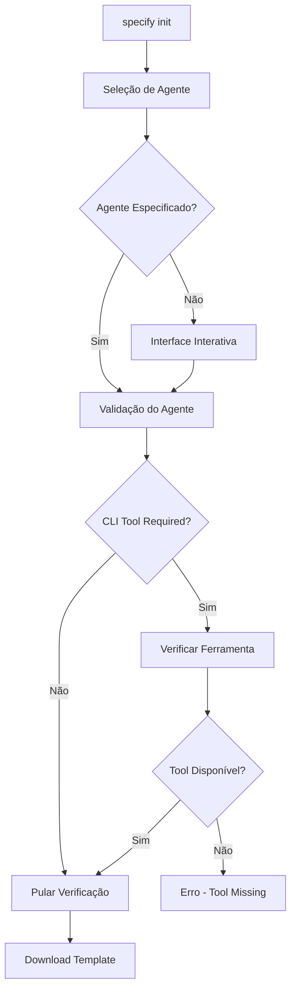
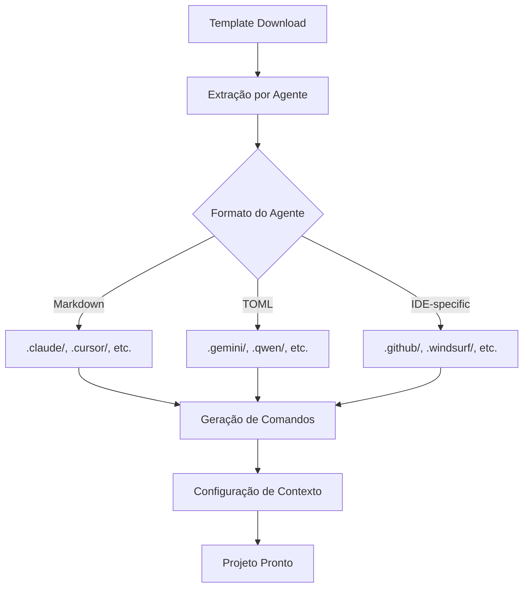

# Análise Inicial do Sistema - Specify CLI

## 📋 Metadados da Análise

| Campo                 | Valor                                           |
| --------------------- | ----------------------------------------------- |
| **Data da Análise**   | 24 de Setembro de 2025                          |
| **Versão Analisada**  | Versão atual do repositório                     |
| **Escopo da Análise** | Arquitetura e fluxo de agentes AI               |
| **Foco Principal**    | Estrutura do Specify CLI e suporte multi-agente |

---

## 🏛️ Visão Geral da Arquitetura

O **Specify CLI** é um toolkit abrangente para **Spec-Driven Development (SDD)** que suporta múltiplos agentes de IA através de uma arquitetura modular e extensível. O sistema é projetado para guiar equipes de desenvolvimento através de um fluxo estruturado: especificação → planejamento → implementação.

### Características Principais

- ✅ **Multi-agente**: Suporte para 11 agentes de IA diferentes
- ✅ **Multiplataforma**: Windows, Linux, macOS
- ✅ **Workflow estruturado**: Processo SDD bem definido
- ✅ **Extensível**: Arquitetura preparada para novos agentes

---

## 🏗️ Componentes Principais e Responsabilidades

### **1. Core CLI (`src/specify_cli/__init__.py`)**

- **Responsabilidade**: Ponto de entrada principal e orquestração
- **Funcionalidades**:
  - Inicialização de projetos com suporte multi-agente
  - Gerenciamento de templates e downloads do GitHub
  - Validação de ferramentas e dependências
  - Interface interativa com seleção por setas
- **Padrões**: Command Pattern, Strategy Pattern para diferentes agentes

### **2. Sistema de Agentes AI**

- **Agentes Suportados**: 11 agentes diferentes
  - **CLI-based**: Claude, Gemini, Cursor, Qwen, opencode, Codex, Auggie
  - **IDE-based**: GitHub Copilot, Windsurf, Kilo Code, Roo
- **Estrutura de Dados**:
  ```python
  AI_CHOICES = {
      "copilot": "GitHub Copilot",
      "claude": "Claude Code",
      "gemini": "Gemini CLI",
      # ... 11 agentes total
  }
  ```

### **3. Templates e Comandos**

- **Templates de Comandos**: 7 comandos principais
  - `/specify` - Criação de especificações
  - `/plan` - Planejamento de implementação
  - `/tasks` - Geração de tarefas
  - `/implement` - Execução de implementação
  - `/clarify` - Clarificação de requisitos
  - `/analyze` - Análise de consistência
  - `/constitution` - Princípios do projeto

### **4. Scripts de Configuração**

- **Bash/PowerShell**: Suporte multiplataforma
- **Funcionalidades**:
  - Atualização de contexto de agentes
  - Criação de features
  - Validação de pré-requisitos
  - Configuração de planos

---

## 🔄 Fluxo de Inicialização de Agentes AI

### **Fase 1: Seleção e Validação**



### **Fase 2: Configuração Específica do Agente**



### **Fase 3: Workflow de Desenvolvimento**

```mermaid
graph TD
    A[/constitution] --> B[/specify]
    B --> C[/clarify]
    C --> D[/plan]
    D --> E[/tasks]
    E --> F[/analyze]
    F --> G[/implement]
    G --> H[Validação]
```

---

## 🎯 Padrões de Design Identificados

### **1. Strategy Pattern**

- **Implementação**: Diferentes agentes com interfaces consistentes
- **Benefício**: Facilita adição de novos agentes sem modificar código core

### **2. Template Method Pattern**

- **Implementação**: Fluxo de comandos padronizado com customizações específicas
- **Benefício**: Consistência no processo SDD independente do agente

### **3. Factory Pattern**

- **Implementação**: Criação de estruturas específicas por agente
- **Benefício**: Encapsula complexidade de configuração por agente

### **4. Command Pattern**

- **Implementação**: Comandos slash como objetos executáveis
- **Benefício**: Facilita extensibilidade e manutenção

---

## ⚡ Pontos Fortes da Arquitetura

### **1. Extensibilidade Multi-Agente**

- Suporte para 11 agentes diferentes
- Processo documentado para adicionar novos agentes
- Separação clara entre CLI-based e IDE-based agents

### **2. Multiplataforma**

- Scripts Bash e PowerShell equivalentes
- Suporte para Windows, Linux, macOS
- Fallbacks para repositórios sem Git

### **3. Workflow Estruturado**

- Processo SDD bem definido e documentado
- Templates executáveis com validação
- Checkpoints e gates de qualidade

### **4. Flexibilidade de Configuração**

- Suporte a diferentes formatos (Markdown, TOML)
- Convenções específicas por agente
- Placeholders dinâmicos para customização

### **5. Robustez Operacional**

- Validação de ferramentas e dependências
- Tratamento de erros abrangente
- Fallbacks para cenários edge-case

---

## ⚠️ Limitações e Gargalos Identificados

### **1. Complexidade de Manutenção**

- **Problema**: 11 agentes requerem manutenção sincronizada
- **Impacto**: Atualizações precisam ser propagadas para todos os agentes
- **Mitigação**: Scripts automatizados de release

### **2. Dependência de Conectividade**

- **Problema**: Download de templates do GitHub é obrigatório
- **Impacto**: Falha em ambientes offline ou com conectividade limitada
- **Mitigação**: Cache local seria benéfico

### **3. Fragmentação de Configuração**

- **Problema**: Diferentes formatos e convenções por agente
- **Impacto**: Curva de aprendizado para desenvolvedores
- **Mitigação**: Documentação abrangente existe

### **4. Escalabilidade de Agentes**

- **Problema**: Adição manual de novos agentes em múltiplos locais
- **Impacto**: Processo propenso a erros
- **Mitigação**: Checklist detalhado no AGENTS.md

### **5. Validação de CLI Tools**

- **Problema**: Verificação limitada de versões e compatibilidade
- **Impacto**: Possíveis incompatibilidades não detectadas
- **Mitigação**: Verificações básicas implementadas

---

## 🔮 Oportunidades de Melhoria

### **1. Plugin Architecture**

- Implementar sistema de plugins para agentes
- Reduzir acoplamento no código core
- Facilitar contribuições da comunidade

### **2. Cache e Offline Support**

- Cache local de templates
- Modo offline para desenvolvimento
- Sincronização inteligente

### **3. Validação Avançada**

- Verificação de versões de ferramentas
- Testes de compatibilidade automatizados
- Health checks mais robustos

### **4. Métricas e Telemetria**

- Coleta de métricas de uso por agente
- Identificação de padrões de falha
- Otimização baseada em dados

---

## 📊 Resumo Executivo

O Specify CLI demonstra uma **arquitetura sólida e bem estruturada** para suporte multi-agente em Spec-Driven Development. Os pontos fortes incluem:

### ✅ **Pontos Fortes**

- **Extensibilidade**: Suporte robusto para 11 agentes diferentes
- **Multiplataforma**: Funciona em Windows, Linux, macOS
- **Workflow Estruturado**: Processo SDD bem definido
- **Documentação**: Guias detalhados para manutenção e extensão

### 🔧 **Áreas de Melhoria**

- **Simplificação da manutenção** através de arquitetura de plugins
- **Suporte offline** com cache local
- **Validação avançada** de ferramentas e compatibilidade

### 🎯 **Conclusão**

A arquitetura atual é **adequada para o propósito** e demonstra boas práticas de design, com espaço para evolução incremental sem necessidade de refatoração major.

---

## 📚 Referências

- [AGENTS.md](../AGENTS.md) - Guia para adição de novos agentes
- [README.md](../README.md) - Documentação principal do projeto
- [src/specify_cli/**init**.py](../src/specify_cli/__init__.py) - Código principal do CLI

---

_Documento gerado em: 24 de Setembro de 2025_  
_Última atualização: 24/09/2025_
