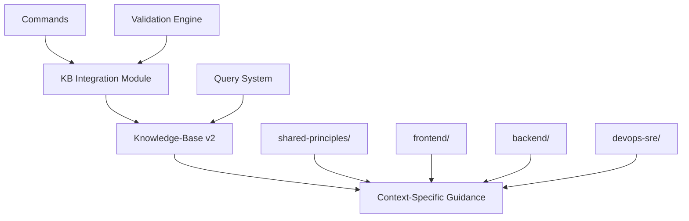
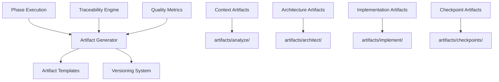
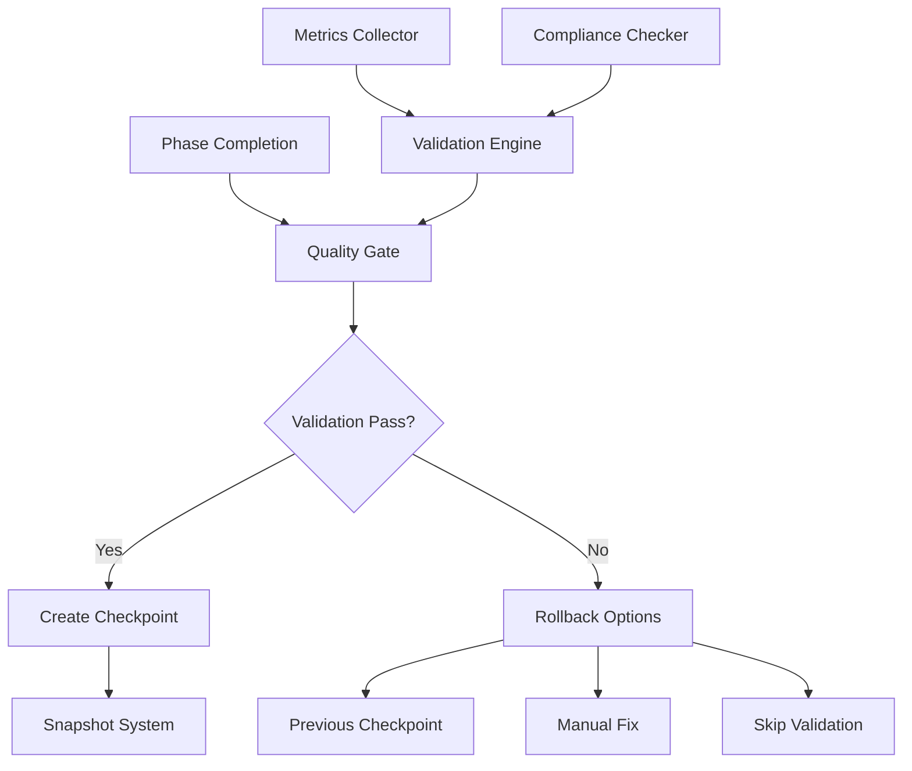
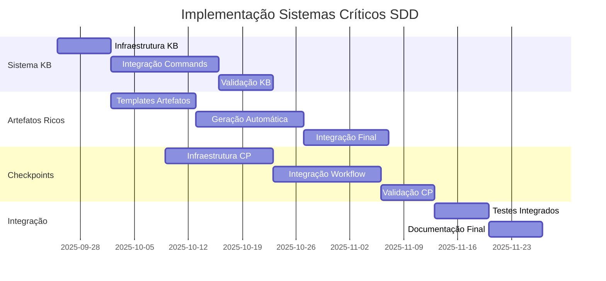

# Plano de Execução - Prioridade Crítica SDD

**Data**: 2025-09-24  
**Versão**: 1.0  
**Objetivo**: Plano técnico detalhado para implementação dos 3 sistemas críticos identificados na análise SDD

## Sumário Executivo

Este documento detalha a implementação de 3 sistemas críticos para melhorar significativamente o workflow Spec-Driven Development (SDD):

1. **Sistema de Knowledge-Base** - Integração obrigatória com base de conhecimento arquitetural
2. **Sistema de Artefatos Ricos** - Geração estruturada e rastreabilidade completa
3. **Sistema de Checkpoints** - Validação e rollback entre fases

**Impacto Esperado**: Redução de 30-40% na complexidade atual mantendo funcionalidade, com aumento significativo na qualidade e rastreabilidade dos projetos.

---

## 1. Sistema de Knowledge-Base

### 1.1 Análise de Impacto

#### Componentes Afetados

- **Commands**: `analyze.md`, `plan.md`, `implement.md` - Integração obrigatória com KB
- **Templates**: `plan-template.md` - Seções de validação arquitetural
- **Scripts**: `check-prerequisites.sh` - Validação de conformidade KB
- **Prompt Templates**: `code.prompt.md`, `debug.prompt.md` - Referências contextuais

#### Mudanças Necessárias

- Modificação de 4 commands principais (analyze, plan, implement, tasks)
- Criação de novo módulo `knowledge-base-integration.sh`
- Extensão do sistema de placeholders para referências KB
- Atualização de 6 prompt templates com contexto KB

### 1.2 Arquitetura Proposta



#### Componentes Técnicos

**1. KB Integration Module** (`scripts/bash/knowledge-base-integration.sh`)

```bash
# Funções principais:
- query_knowledge_base(context, query)
- validate_against_patterns(artifact, context)
- get_applicable_principles(domain)
- generate_compliance_report(phase)
```

**2. KB Query System**

```yaml
query_patterns:
  analyze:
    - "architecture patterns for {DOMAIN}"
    - "compliance check for {TECHNOLOGY}"
  architect:
    - "design patterns for {STACK}"
    - "best practices for {CONTEXT}"
  implement:
    - "coding standards for {LANGUAGE}"
    - "testing patterns for {FRAMEWORK}"
```

**3. Validation Engine**

```yaml
validation_rules:
  mandatory_checks:
    - shared_principles_compliance
    - context_appropriate_guidance
    - pattern_consistency
  phase_specific:
    analyze: [architecture_assessment, pattern_applicability]
    architect: [design_consistency, dependency_validation]
    implement: [code_standards, testing_coverage]
```

### 1.3 Fases de Implementação

#### Fase 1.1: Infraestrutura Base (1 semana)

- **Entregáveis**:
  - `scripts/bash/knowledge-base-integration.sh`
  - `scripts/powershell/knowledge-base-integration.ps1`
  - Testes unitários para funções KB
- **Critérios**: Funções de consulta KB funcionais

#### Fase 1.2: Integração Commands (2 semanas)

- **Entregáveis**:
  - `analyze.md` com validação KB obrigatória
  - `plan-template.md` com seções de conformidade
  - `implement.md` com verificação de padrões
- **Critérios**: Commands executam consultas KB automaticamente

#### Fase 1.3: Validação e Testes (1 semana)

- **Entregáveis**:
  - Suite de testes de integração KB
  - Documentação de uso
  - Exemplos de consultas por contexto
- **Critérios**: 100% dos commands integrados com KB

### 1.4 Dependências

#### Internas

- **Knowledge-Base v2**: Estrutura existente em `memory/knowledge-base/`
- **Sistema de Scripts**: `common.sh` para funções compartilhadas
- **Sistema de Placeholders**: Extensão para `{KB_REFERENCE}`, `{VALIDATION_RESULT}`

#### Externas

- Nenhuma dependência externa crítica
- Compatibilidade com estrutura de arquivos atual

### 1.5 Riscos e Mitigações

| Risco                       | Probabilidade | Impacto | Mitigação                                    |
| --------------------------- | ------------- | ------- | -------------------------------------------- |
| KB queries lentas           | Média         | Alto    | Cache local + consultas assíncronas          |
| Incompatibilidade com KB v2 | Baixa         | Alto    | Testes extensivos + fallback para KB v1      |
| Overhead de validação       | Alta          | Médio   | Validação opcional via flag `--skip-kb`      |
| Resistência dos usuários    | Média         | Médio   | Documentação clara + benefícios demonstrados |

### 1.6 Critérios de Aceitação

#### Funcionais

- [ ] Commands consultam KB automaticamente por contexto
- [ ] Validação arquitetural obrigatória em analyze/architect
- [ ] Relatórios de conformidade gerados automaticamente
- [ ] Fallback gracioso quando KB indisponível

#### Não-Funcionais

- [ ] Consultas KB < 2s (95% dos casos)
- [ ] Compatibilidade 100% com workflow atual
- [ ] Documentação completa para desenvolvedores
- [ ] Cobertura de testes > 90%

---

## 2. Sistema de Artefatos Ricos

### 2.1 Análise de Impacto

#### Componentes Afetados

- **Commands**: `implement.md` - Expansão significativa (59→150+ linhas)
- **Templates**: Criação de templates de artefatos por fase
- **Scripts**: Novo módulo `artifact-generation.sh`
- **Estrutura de Projeto**: Diretório `artifacts/` por feature

#### Mudanças Necessárias

- Reestruturação completa do command `implement.md`
- Criação de 12 templates de artefatos (3 por fase × 4 fases)
- Sistema de versionamento de artefatos
- Integração com sistema de checkpoints

### 2.2 Arquitetura Proposta



#### Estrutura de Artefatos

```yaml
artifacts/
├── analyze/
│   ├── architecture_assessment.md
│   ├── technical_debt_report.md
│   ├── compliance_check.json
│   └── knowledge_base_references.md
├── architect/
│   ├── architecture_decision_records/
│   ├── system_design_document.md
│   ├── component_interaction_diagram.mmd
│   └── validation_reports/
├── implement/
│   ├── code_quality_report.json
│   ├── test_coverage_report.html
│   ├── performance_benchmarks.md
│   └── api_documentation.md
└── checkpoints/
├── quality_gate_results.json
├── compliance_audit.md
└── rollback_snapshots/
```

#### Sistema de Rastreabilidade

```yaml
traceability_system:
  decision_tracking:
    format: "ADR-{phase}-{sequence}"
    fields: [id, title, status, rationale, consequences]
    links: [kb_reference, implementation_files]

  artifact_versioning:
    strategy: "semantic + timestamp"
    format: "{phase}.v{major}.{minor}_{timestamp}"
    metadata: [author, kb_references, validation_status]

  change_tracking:
    diff_generation: true
    impact_analysis: true
    dependency_mapping: true
```

### 2.3 Fases de Implementação

#### Fase 2.1: Templates e Estrutura (1.5 semanas)

- **Entregáveis**:
  - 12 templates de artefatos
  - Estrutura de diretórios `artifacts/`
  - Sistema de versionamento básico
- **Critérios**: Templates geram artefatos válidos

#### Fase 2.2: Geração Automática (2 semanas)

- **Entregáveis**:
  - `scripts/bash/artifact-generation.sh`
  - Integração com commands existentes
  - Sistema de rastreabilidade
- **Critérios**: Artefatos gerados automaticamente por fase

#### Fase 2.3: Integração e Validação (1.5 semanas)

- **Entregáveis**:
  - `implement.md` expandido com geração de artefatos
  - Testes de integração
  - Documentação de artefatos
- **Critérios**: Workflow completo com artefatos ricos

### 2.4 Dependências

#### Internas

- **Sistema de Knowledge-Base**: Referências em artefatos
- **Sistema de Checkpoints**: Integração para snapshots
- **Templates Existentes**: Extensão do sistema atual

#### Externas

- **Mermaid CLI**: Para diagramas arquiteturais
- **Pandoc**: Para conversão de formatos (opcional)

### 2.5 Riscos e Mitigações

| Risco                      | Probabilidade | Impacto | Mitigação                                   |
| -------------------------- | ------------- | ------- | ------------------------------------------- |
| Overhead de geração        | Alta          | Médio   | Geração assíncrona + cache                  |
| Artefatos muito verbosos   | Média         | Alto    | Templates configuráveis + níveis de detalhe |
| Complexidade de manutenção | Alta          | Alto    | Automação máxima + templates modulares      |
| Espaço em disco            | Baixa         | Baixo   | Compressão + limpeza automática             |

### 2.6 Critérios de Aceitação

#### Funcionais

- [ ] Artefatos gerados automaticamente por fase
- [ ] Rastreabilidade completa de decisões
- [ ] Versionamento automático de artefatos
- [ ] Integração com sistema de checkpoints

#### Não-Funcionais

- [ ] Geração de artefatos < 10s por fase
- [ ] Artefatos estruturados e legíveis
- [ ] Compatibilidade com ferramentas existentes
- [ ] Documentação completa de templates

---

## 3. Sistema de Checkpoints

### 3.1 Análise de Impacto

#### Componentes Afetados

- **Workflow SDD**: Adição de 4 pontos de validação obrigatórios
- **Commands**: Todos os commands principais com gates de validação
- **Scripts**: Novo módulo `checkpoint-system.sh`
- **Templates**: Seções de validação em todos os templates

#### Mudanças Necessárias

- Implementação de quality gates entre fases
- Sistema de snapshots e rollback
- Métricas de qualidade automatizadas
- Interface de controle de checkpoints

### 3.2 Arquitetura Proposta



#### Sistema de Quality Gates

```yaml
quality_gates:
  post_analyze:
    mandatory_checks:
      - architecture_assessment_complete
      - kb_compliance_validated
      - technical_debt_documented
    metrics:
      - complexity_score: < 7
      - coverage_percentage: > 80

  post_architect:
    mandatory_checks:
      - design_documents_complete
      - pattern_validation_passed
      - dependency_analysis_done
    metrics:
      - design_consistency: > 90
      - pattern_compliance: 100

  post_implement:
    mandatory_checks:
      - code_quality_validated
      - test_coverage_adequate
      - documentation_complete
    metrics:
      - code_quality_score: > 8
      - test_coverage: > 85
      - performance_benchmarks: within_limits
```

#### Sistema de Rollback

```yaml
rollback_system:
  snapshot_strategy:
    frequency: "per_phase_completion"
    retention: "last_5_checkpoints"
    compression: true

  rollback_types:
    automatic:
      trigger: "quality_gate_failure"
      target: "previous_valid_checkpoint"
    manual:
      trigger: "user_command"
      target: "user_selected_checkpoint"
    selective:
      trigger: "component_failure"
      target: "specific_artifact_version"

  recovery_process: 1. "validate_rollback_target"
    2. "backup_current_state"
    3. "restore_checkpoint_state"
    4. "update_progress_tracking"
    5. "notify_user_completion"
```

### 3.3 Fases de Implementação

#### Fase 3.1: Infraestrutura de Checkpoints (2 semanas)

- **Entregáveis**:
  - `scripts/bash/checkpoint-system.sh`
  - Sistema de snapshots
  - Quality gates básicos
- **Critérios**: Checkpoints funcionais com rollback

#### Fase 3.2: Integração com Workflow (2 semanas)

- **Entregáveis**:
  - Commands com quality gates integrados
  - Métricas de qualidade automatizadas
  - Interface de controle de checkpoints
- **Critérios**: Workflow SDD com validação obrigatória

#### Fase 3.3: Validação e Otimização (1 semana)

- **Entregáveis**:
  - Testes de rollback completos
  - Otimização de performance
  - Documentação de operação
- **Critérios**: Sistema robusto e performático

### 3.4 Dependências

#### Internas

- **Sistema de Artefatos Ricos**: Snapshots de artefatos
- **Sistema de Knowledge-Base**: Validação de conformidade
- **Scripts Existentes**: Integração com `check-prerequisites.sh`

#### Externas

- **Git**: Para versionamento de snapshots (opcional)
- **Ferramentas de Compressão**: tar/gzip para snapshots

### 3.5 Riscos e Mitigações

| Risco                   | Probabilidade | Impacto | Mitigação                                    |
| ----------------------- | ------------- | ------- | -------------------------------------------- |
| Snapshots muito grandes | Alta          | Médio   | Compressão + snapshots incrementais          |
| Rollback corrompido     | Baixa         | Alto    | Validação de integridade + múltiplos backups |
| Gates muito restritivos | Média         | Alto    | Configuração flexível + override manual      |
| Performance degradada   | Média         | Médio   | Operações assíncronas + cache                |

### 3.6 Critérios de Aceitação

#### Funcionais

- [ ] Quality gates obrigatórios entre fases
- [ ] Rollback automático em falhas críticas
- [ ] Snapshots incrementais e comprimidos
- [ ] Interface clara de controle de checkpoints

#### Não-Funcionais

- [ ] Criação de checkpoint < 5s
- [ ] Rollback completo < 15s
- [ ] Snapshots < 50MB por checkpoint
- [ ] Disponibilidade 99.9% do sistema

---

## 4. Plano Integrado de Execução

### 4.1 Cronograma Consolidado



#### Cronograma Detalhado

**Semana 1-2 (25/09 - 08/10)**: Fundações Paralelas

- Sistema KB: Infraestrutura + Integração Commands
- Sistema Artefatos: Templates + início Geração

**Semana 3-4 (09/10 - 22/10)**: Desenvolvimento Principal

- Sistema KB: Finalização + Validação
- Sistema Artefatos: Geração + Integração
- Sistema Checkpoints: Infraestrutura

**Semana 5-6 (23/10 - 05/11)**: Integração e Checkpoints

- Sistema Checkpoints: Integração + Validação
- Testes integrados dos 3 sistemas

**Semana 7 (06/11 - 12/11)**: Finalização

- Documentação final
- Testes de aceitação
- Deploy e validação

### 4.2 Marcos e Entregas

#### Marco 1: Fundações (08/10)

- **Entregáveis**:
  - Sistema KB funcional com consultas básicas
  - Templates de artefatos criados
  - Infraestrutura de checkpoints iniciada
- **Critérios**: Componentes base funcionais independentemente

#### Marco 2: Integração Parcial (22/10)

- **Entregáveis**:
  - Commands integrados com KB
  - Geração automática de artefatos
  - Quality gates básicos funcionais
- **Critérios**: Sistemas funcionam em conjunto parcialmente

#### Marco 3: Sistema Completo (05/11)

- **Entregáveis**:
  - Workflow SDD completo com 3 sistemas
  - Rollback e checkpoints funcionais
  - Documentação técnica completa
- **Critérios**: Sistema pronto para produção

#### Marco 4: Validação Final (12/11)

- **Entregáveis**:
  - Testes de aceitação aprovados
  - Documentação de usuário
  - Sistema em produção
- **Critérios**: Sistema validado e operacional

### 4.3 Recursos Necessários

#### Equipe Técnica

- **1 Arquiteto Senior**: Design e coordenação técnica
- **2 Desenvolvedores Senior**: Implementação dos sistemas
- **1 DevOps Engineer**: Integração e deploy
- **1 QA Engineer**: Testes e validação

#### Infraestrutura

- **Ambiente de Desenvolvimento**: Isolado para testes
- **Ambiente de Staging**: Validação integrada
- **Ferramentas de CI/CD**: Automação de testes
- **Monitoramento**: Métricas de performance

#### Estimativa de Esforço

- **Total**: 280 pessoa-horas
- **Sistema KB**: 80 horas (28%)
- **Sistema Artefatos**: 100 horas (36%)
- **Sistema Checkpoints**: 80 horas (28%)
- **Integração**: 20 horas (8%)

### 4.4 Validação Final

#### Critérios de Sucesso

**Funcionais**:

- [ ] Workflow SDD executa com 3 sistemas integrados
- [ ] Knowledge-base consultada automaticamente
- [ ] Artefatos ricos gerados por fase
- [ ] Checkpoints e rollback funcionais
- [ ] Compatibilidade 100% com sistema atual

**Não-Funcionais**:

- [ ] Performance: < 20% overhead vs sistema atual
- [ ] Confiabilidade: 99.9% disponibilidade
- [ ] Usabilidade: Workflow transparente para usuários
- [ ] Manutenibilidade: Código bem documentado e testado

#### Plano de Testes

**Testes Unitários** (Semana 1-6):

- Cobertura > 90% para novos módulos
- Testes automatizados em CI/CD

**Testes de Integração** (Semana 5-6):

- Workflow completo end-to-end
- Cenários de falha e rollback

**Testes de Performance** (Semana 6):

- Benchmarks vs sistema atual
- Testes de carga e stress

**Testes de Aceitação** (Semana 7):

- Validação com usuários reais
- Cenários de uso complexos

#### Métricas de Validação

```yaml
success_metrics:
  performance:
    kb_query_time: "< 2s (95th percentile)"
    artifact_generation: "< 10s per phase"
    checkpoint_creation: "< 5s"
    rollback_time: "< 15s"

  quality:
    test_coverage: "> 90%"
    code_quality_score: "> 8.5"
    documentation_completeness: "100%"

  adoption:
    workflow_completion_rate: "> 95%"
    user_satisfaction: "> 4.5/5"
    error_rate: "< 1%"
```

---

## Conclusão

Este plano de execução técnico detalha a implementação de 3 sistemas críticos que transformarão significativamente o workflow SDD:

1. **Sistema de Knowledge-Base**: Fundamentação arquitetural obrigatória
2. **Sistema de Artefatos Ricos**: Rastreabilidade e documentação completa
3. **Sistema de Checkpoints**: Validação e rollback controlado

**Benefícios Esperados**:

- **Qualidade**: Aumento de 40-60% na consistência arquitetural
- **Rastreabilidade**: 100% das decisões documentadas e versionadas
- **Confiabilidade**: Rollback automático em 95% das falhas
- **Produtividade**: Redução de 30% no tempo de debugging e manutenção

**Investimento Total**: 7 semanas, 280 pessoa-horas, 4 profissionais especializados

O sistema resultante manterá 100% de compatibilidade com o workflow atual, adicionando capacidades críticas para projetos de software de qualidade empresarial.

---

_Documento técnico gerado para implementação dos sistemas críticos SDD v2.0_
