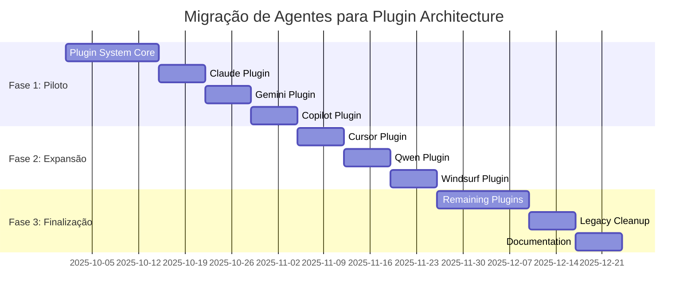

# Plugin Architecture Foundation - Especificação Técnica

## 📋 Metadados da Especificação

| Campo                   | Valor                                     |
| ----------------------- | ----------------------------------------- |
| **Data de Criação**     | 24 de Setembro de 2025                    |
| **Versão**              | 1.0                                       |
| **Entregável**          | Plugin Architecture Foundation (Fase 1.2) |
| **Baseado na Análise**  | docs/initial_system_analise.md            |
| **Plano de Referência** | expansion_system_execute_plan.md          |

---

## 🎯 Visão Geral

A **Plugin Architecture Foundation** é o segundo entregável da Fase 1 do plano de expansão do Specify CLI, projetada para resolver a limitação crítica de "Complexidade de Manutenção" onde 11 agentes requerem manutenção sincronizada. Esta arquitetura criará um sistema extensível que reduz o acoplamento no código core e facilita a adição de novos agentes.

### Objetivos Principais

- **Reduzir Complexidade**: 60% de redução no tempo de adição de novos agentes
- **Desacoplar Core**: Separar lógica de agentes do código principal
- **Facilitar Extensibilidade**: Interface padronizada para plugins
- **Manter Compatibilidade**: Migração transparente dos agentes existentes
- **Habilitar Comunidade**: Base para contribuições externas

---

## 🏗️ Análise da Estrutura Atual

### Padrões Identificados nos 11 Agentes

Baseado na análise do código atual (`src/specify_cli/__init__.py`), identifiquei os seguintes padrões:

#### 1. **Categorização de Agentes**

```python
# CLI-based Agents (requerem ferramenta CLI)
CLI_AGENTS = ["claude", "gemini", "cursor", "qwen", "opencode", "codex", "auggie"]

# IDE-based Agents (integrados em IDEs)
IDE_AGENTS = ["copilot", "windsurf", "kilocode", "roo"]
```

#### 2. **Estrutura de Dados Atual**

```python
AI_CHOICES = {
    "copilot": "GitHub Copilot",
    "claude": "Claude Code",
    "gemini": "Gemini CLI",
    "cursor": "Cursor",
    "qwen": "Qwen Code",
    "opencode": "opencode",
    "codex": "Codex CLI",
    "windsurf": "Windsurf",
    "kilocode": "Kilo Code",
    "auggie": "Auggie CLI",
    "roo": "Roo Code",
}

agent_folder_map = {
    "claude": ".claude/",
    "gemini": ".gemini/",
    "cursor": ".cursor/",
    "qwen": ".qwen/",
    "opencode": ".opencode/",
    "codex": ".codex/",
    "windsurf": ".windsurf/",
    "kilocode": ".kilocode/",
    "auggie": ".augment/",
    "copilot": ".github/",
    "roo": ".roo/"
}
```

#### 3. **Formatos de Comando**

- **Markdown**: Claude, Cursor, opencode, Windsurf, Copilot
- **TOML**: Gemini, Qwen

#### 4. **Convenções de Argumentos**

- **Markdown/prompt-based**: `$ARGUMENTS`
- **TOML-based**: `{{args}}`
- **Script placeholders**: `{SCRIPT}`
- **Agent placeholders**: `__AGENT__`

---

## 🔧 Arquitetura de Plugins

### Estrutura de Diretórios Proposta

```
plugins/
├── core/                           # Plugins oficiais (migrados dos 11 agentes atuais)
│   ├── claude/
│   │   ├── plugin.yaml            # Metadados e configuração
│   │   ├── commands/              # Templates de comandos
│   │   │   ├── specify.md
│   │   │   ├── plan.md
│   │   │   └── implement.md
│   │   ├── templates/             # Templates específicos do agente
│   │   │   └── project-template/
│   │   ├── validators/            # Validadores específicos
│   │   │   └── cli_validator.py
│   │   └── hooks/                 # Hooks de ciclo de vida
│   │       ├── init.py
│   │       ├── validate.py
│   │       └── cleanup.py
│   ├── gemini/
│   │   ├── plugin.yaml
│   │   ├── commands/
│   │   ├── templates/
│   │   └── hooks/
│   └── copilot/
│       ├── plugin.yaml
│       ├── commands/
│       └── templates/
├── community/                      # Plugins da comunidade
│   ├── custom-agent-1/
│   └── experimental-agent/
├── registry.json                   # Registro de plugins disponíveis
└── schema/                         # Esquemas de validação
    ├── plugin-schema.yaml
    └── command-schema.yaml
```

---

## 📄 Interface Padrão de Plugin

### Formato do Arquivo plugin.yaml

```yaml
# Plugin Metadata
name: "claude"
display_name: "Claude Code"
version: "1.0.0"
description: "Anthropic's Claude Code CLI integration"
author: "GitHub Spec Kit Team"
license: "MIT"
homepage: "https://docs.anthropic.com/en/docs/claude-code/setup"

# Compatibility
specify_version: ">=2.0.0"
python_version: ">=3.11"
platforms: ["linux", "macos", "windows"]

# Agent Configuration
agent:
  type: "cli" # cli | ide | hybrid
  category: "code_generation" # code_generation | planning | analysis
  cli_tool: "claude" # Nome da ferramenta CLI (se aplicável)
  cli_check_args: ["--version"] # Argumentos para verificar instalação

# Directory Structure
directories:
  base: ".claude"
  commands: ".claude/commands"
  rules: ".claude/rules"
  templates: ".claude/templates"

# Command Configuration
commands:
  format: "markdown" # markdown | toml | json
  extension: ".md"
  argument_pattern: "$ARGUMENTS"
  script_pattern: "{SCRIPT}"
  agent_pattern: "__AGENT__"

# Dependencies
dependencies:
  system:
    - name: "claude"
      type: "cli"
      required: true
      install_url: "https://docs.anthropic.com/en/docs/claude-code/setup"
  python: []

# Hooks
hooks:
  init: "hooks/init.py"
  validate: "hooks/validate.py"
  post_install: "hooks/post_install.py"
  cleanup: "hooks/cleanup.py"

# Security
security:
  sandbox: true
  network_access: false
  file_system_access: "restricted" # none | restricted | full
  allowed_paths:
    - ".claude/"
    - ".specify/"

# Templates
templates:
  - name: "specify"
    path: "commands/specify.md"
    description: "Create specifications"
  - name: "plan"
    path: "commands/plan.md"
    description: "Generate implementation plans"
  - name: "implement"
    path: "commands/implement.md"
    description: "Execute implementation"

# Validation Rules
validation:
  required_files:
    - "commands/specify.md"
    - "commands/plan.md"
    - "commands/implement.md"
  optional_files:
    - "commands/clarify.md"
    - "commands/analyze.md"
```

---

## 🔌 API de Interface de Plugins

### Classe Base AbstractAgentPlugin

```python
from abc import ABC, abstractmethod
from typing import Dict, List, Optional, Any
from pathlib import Path
from dataclasses import dataclass

@dataclass
class PluginMetadata:
    name: str
    display_name: str
    version: str
    description: str
    author: str
    agent_type: str  # cli | ide | hybrid
    cli_tool: Optional[str] = None
    directories: Dict[str, str] = None
    commands: Dict[str, Any] = None

class AbstractAgentPlugin(ABC):
    """Interface padrão para plugins de agentes."""

    def __init__(self, plugin_path: Path, metadata: PluginMetadata):
        self.plugin_path = plugin_path
        self.metadata = metadata
        self._initialized = False

    @abstractmethod
    def validate_environment(self) -> bool:
        """Valida se o ambiente suporta este plugin."""
        pass

    @abstractmethod
    def initialize(self, project_path: Path) -> bool:
        """Inicializa o plugin para um projeto."""
        pass

    @abstractmethod
    def create_project_structure(self, project_path: Path) -> bool:
        """Cria a estrutura de diretórios específica do agente."""
        pass

    @abstractmethod
    def generate_commands(self, project_path: Path, script_type: str) -> bool:
        """Gera os comandos específicos do agente."""
        pass

    @abstractmethod
    def validate_installation(self) -> Dict[str, Any]:
        """Valida se as dependências estão instaladas."""
        pass

    def cleanup(self, project_path: Path) -> bool:
        """Limpa recursos do plugin."""
        return True

    def get_security_requirements(self) -> Dict[str, Any]:
        """Retorna requisitos de segurança do plugin."""
        return {
            "sandbox": True,
            "network_access": False,
            "file_system_access": "restricted"
        }
```

### Plugin Manager

```python
class PluginManager:
    """Gerenciador central de plugins."""

    def __init__(self, plugins_dir: Path):
        self.plugins_dir = plugins_dir
        self.loaded_plugins: Dict[str, AbstractAgentPlugin] = {}
        self.plugin_registry: Dict[str, PluginMetadata] = {}

    def discover_plugins(self) -> List[str]:
        """Descobre plugins disponíveis."""
        plugins = []

        # Core plugins
        core_dir = self.plugins_dir / "core"
        if core_dir.exists():
            plugins.extend(self._scan_directory(core_dir))

        # Community plugins
        community_dir = self.plugins_dir / "community"
        if community_dir.exists():
            plugins.extend(self._scan_directory(community_dir))

        return plugins

    def load_plugin(self, plugin_name: str) -> Optional[AbstractAgentPlugin]:
        """Carrega um plugin específico."""
        if plugin_name in self.loaded_plugins:
            return self.loaded_plugins[plugin_name]

        plugin_path = self._find_plugin_path(plugin_name)
        if not plugin_path:
            return None

        metadata = self._load_plugin_metadata(plugin_path)
        if not metadata:
            return None

        plugin_class = self._load_plugin_class(plugin_path, metadata)
        if not plugin_class:
            return None

        plugin = plugin_class(plugin_path, metadata)

        # Validar plugin
        if not self._validate_plugin(plugin):
            return None

        self.loaded_plugins[plugin_name] = plugin
        return plugin

    def validate_plugin_compatibility(self, plugin: AbstractAgentPlugin) -> bool:
        """Valida compatibilidade do plugin."""
        # Verificar versão do Specify
        # Verificar versão do Python
        # Verificar plataforma
        # Verificar dependências
        return True

    def get_available_plugins(self) -> List[PluginMetadata]:
        """Retorna lista de plugins disponíveis."""
        return list(self.plugin_registry.values())
```

---

## 🔒 Sistema de Isolamento e Sandboxing

### Sandbox de Execução

```python
import subprocess
import tempfile
import shutil
from pathlib import Path
from typing import Dict, List, Optional

class PluginSandbox:
    """Sistema de isolamento para execução de plugins."""

    def __init__(self, plugin: AbstractAgentPlugin, project_path: Path):
        self.plugin = plugin
        self.project_path = project_path
        self.temp_dir = None
        self.allowed_paths = self._get_allowed_paths()

    def __enter__(self):
        """Entra no contexto do sandbox."""
        self.temp_dir = Path(tempfile.mkdtemp(prefix="specify_plugin_"))
        return self

    def __exit__(self, exc_type, exc_val, exc_tb):
        """Sai do contexto do sandbox."""
        if self.temp_dir and self.temp_dir.exists():
            shutil.rmtree(self.temp_dir)

    def execute_hook(self, hook_name: str, **kwargs) -> bool:
        """Executa um hook do plugin em ambiente isolado."""
        hook_path = self.plugin.plugin_path / "hooks" / f"{hook_name}.py"
        if not hook_path.exists():
            return True  # Hook opcional

        # Preparar ambiente isolado
        env = self._prepare_environment()

        # Executar hook com limitações
        try:
            result = subprocess.run(
                [sys.executable, str(hook_path)],
                env=env,
                cwd=self.temp_dir,
                timeout=30,  # Timeout de 30 segundos
                capture_output=True,
                text=True
            )
            return result.returncode == 0
        except subprocess.TimeoutExpired:
            return False
        except Exception:
            return False

    def _get_allowed_paths(self) -> List[Path]:
        """Retorna caminhos permitidos para o plugin."""
        security = self.plugin.get_security_requirements()
        allowed = [self.project_path / ".specify"]

        if "allowed_paths" in security:
            for path in security["allowed_paths"]:
                allowed.append(self.project_path / path)

        return allowed

    def _prepare_environment(self) -> Dict[str, str]:
        """Prepara ambiente de execução restrito."""
        env = os.environ.copy()

        # Remover variáveis sensíveis
        sensitive_vars = ["HOME", "USER", "PATH"]
        for var in sensitive_vars:
            if var in env:
                del env[var]

        # Adicionar variáveis específicas do plugin
        env["SPECIFY_PLUGIN_NAME"] = self.plugin.metadata.name
        env["SPECIFY_PROJECT_PATH"] = str(self.project_path)
        env["SPECIFY_TEMP_DIR"] = str(self.temp_dir)

        return env
```

### Validação de Segurança

```python
class SecurityValidator:
    """Validador de segurança para plugins."""

    DANGEROUS_IMPORTS = [
        "os.system", "subprocess.call", "eval", "exec",
        "importlib", "__import__", "open"
    ]

    ALLOWED_MODULES = [
        "pathlib", "json", "yaml", "typing", "dataclasses",
        "abc", "logging", "datetime"
    ]

    def validate_plugin_code(self, plugin_path: Path) -> Dict[str, Any]:
        """Valida código do plugin para segurança."""
        results = {
            "safe": True,
            "warnings": [],
            "errors": []
        }

        # Verificar arquivos Python
        for py_file in plugin_path.rglob("*.py"):
            file_results = self._validate_python_file(py_file)
            results["warnings"].extend(file_results["warnings"])
            results["errors"].extend(file_results["errors"])

            if file_results["errors"]:
                results["safe"] = False

        return results

    def _validate_python_file(self, file_path: Path) -> Dict[str, Any]:
        """Valida um arquivo Python específico."""
        results = {"warnings": [], "errors": []}

        try:
            with open(file_path, 'r', encoding='utf-8') as f:
                content = f.read()

            # Verificar imports perigosos
            for dangerous in self.DANGEROUS_IMPORTS:
                if dangerous in content:
                    results["errors"].append(
                        f"Dangerous import '{dangerous}' found in {file_path}"
                    )

            # Verificar uso de eval/exec
            if "eval(" in content or "exec(" in content:
                results["errors"].append(
                    f"Dynamic code execution found in {file_path}"
                )

        except Exception as e:
            results["errors"].append(f"Failed to read {file_path}: {e}")

        return results
```

---

## 🔍 Sistema de Descoberta e Carregamento

### Plugin Discovery

```python
class PluginDiscovery:
    """Sistema de descoberta de plugins."""

    def __init__(self, plugins_dir: Path):
        self.plugins_dir = plugins_dir
        self.cache_file = plugins_dir / ".plugin_cache.json"
        self.cache = self._load_cache()

    def scan_for_plugins(self) -> Dict[str, PluginMetadata]:
        """Escaneia diretórios em busca de plugins."""
        plugins = {}

        # Escanear plugins core
        core_plugins = self._scan_core_plugins()
        plugins.update(core_plugins)

        # Escanear plugins da comunidade
        community_plugins = self._scan_community_plugins()
        plugins.update(community_plugins)

        # Atualizar cache
        self._update_cache(plugins)

        return plugins

    def _scan_core_plugins(self) -> Dict[str, PluginMetadata]:
        """Escaneia plugins core."""
        plugins = {}
        core_dir = self.plugins_dir / "core"

        if not core_dir.exists():
            return plugins

        for plugin_dir in core_dir.iterdir():
            if not plugin_dir.is_dir():
                continue

            plugin_yaml = plugin_dir / "plugin.yaml"
            if not plugin_yaml.exists():
                continue

            try:
                metadata = self._load_plugin_metadata(plugin_yaml)
                if metadata:
                    plugins[metadata.name] = metadata
            except Exception as e:
                logging.warning(f"Failed to load plugin {plugin_dir.name}: {e}")

        return plugins

    def _load_plugin_metadata(self, plugin_yaml: Path) -> Optional[PluginMetadata]:
        """Carrega metadados de um plugin."""
        try:
            import yaml
            with open(plugin_yaml, 'r', encoding='utf-8') as f:
                data = yaml.safe_load(f)

            return PluginMetadata(
                name=data["name"],
                display_name=data["display_name"],
                version=data["version"],
                description=data["description"],
                author=data["author"],
                agent_type=data["agent"]["type"],
                cli_tool=data["agent"].get("cli_tool"),
                directories=data.get("directories", {}),
                commands=data.get("commands", {})
            )
        except Exception as e:
            logging.error(f"Failed to load plugin metadata from {plugin_yaml}: {e}")
            return None
```

### Plugin Loader

```python
class PluginLoader:
    """Carregador de plugins com validação."""

    def __init__(self, discovery: PluginDiscovery, security: SecurityValidator):
        self.discovery = discovery
        self.security = security
        self.loaded_plugins: Dict[str, AbstractAgentPlugin] = {}

    def load_plugin(self, plugin_name: str) -> Optional[AbstractAgentPlugin]:
        """Carrega um plugin com validação completa."""
        # Verificar se já está carregado
        if plugin_name in self.loaded_plugins:
            return self.loaded_plugins[plugin_name]

        # Descobrir plugin
        plugins = self.discovery.scan_for_plugins()
        if plugin_name not in plugins:
            return None

        metadata = plugins[plugin_name]
        plugin_path = self._get_plugin_path(plugin_name)

        # Validação de segurança
        security_results = self.security.validate_plugin_code(plugin_path)
        if not security_results["safe"]:
            logging.error(f"Plugin {plugin_name} failed security validation")
            return None

        # Carregar classe do plugin
        plugin_class = self._load_plugin_class(plugin_path, metadata)
        if not plugin_class:
            return None

        # Instanciar plugin
        plugin = plugin_class(plugin_path, metadata)

        # Validar compatibilidade
        if not self._validate_compatibility(plugin):
            return None

        self.loaded_plugins[plugin_name] = plugin
        return plugin

    def _load_plugin_class(self, plugin_path: Path, metadata: PluginMetadata) -> Optional[type]:
        """Carrega a classe do plugin dinamicamente."""
        # Implementar carregamento dinâmico baseado no tipo de agente
        if metadata.agent_type == "cli":
            return CLIAgentPlugin
        elif metadata.agent_type == "ide":
            return IDEAgentPlugin
        else:
            return HybridAgentPlugin
```

---

## 🔄 Estratégia de Migração

### Fase 1: Migração de 3 Agentes Piloto

**Agentes Selecionados**: Claude, Gemini, Copilot (representam os 3 tipos principais)

#### 1. Claude (CLI-based, Markdown)

```yaml
# plugins/core/claude/plugin.yaml
name: "claude"
display_name: "Claude Code"
version: "1.0.0"
description: "Anthropic's Claude Code CLI integration"
author: "GitHub Spec Kit Team"

agent:
  type: "cli"
  cli_tool: "claude"

directories:
  base: ".claude"
  commands: ".claude/commands"

commands:
  format: "markdown"
  extension: ".md"
  argument_pattern: "$ARGUMENTS"
```

#### 2. Gemini (CLI-based, TOML)

```yaml
# plugins/core/gemini/plugin.yaml
name: "gemini"
display_name: "Gemini CLI"
version: "1.0.0"
description: "Google's Gemini CLI integration"

agent:
  type: "cli"
  cli_tool: "gemini"

commands:
  format: "toml"
  extension: ".toml"
  argument_pattern: "{{args}}"
```

#### 3. Copilot (IDE-based, Markdown)

```yaml
# plugins/core/copilot/plugin.yaml
name: "copilot"
display_name: "GitHub Copilot"
version: "1.0.0"
description: "GitHub Copilot integration"

agent:
  type: "ide"

directories:
  base: ".github"
  commands: ".github/prompts"

commands:
  format: "markdown"
  extension: ".md"
```

### Cronograma de Migração



### Compatibilidade Durante Transição

```python
class LegacyCompatibilityLayer:
    """Camada de compatibilidade para agentes legados."""

    def __init__(self, plugin_manager: PluginManager):
        self.plugin_manager = plugin_manager
        self.legacy_agents = set(AI_CHOICES.keys())

    def handle_legacy_agent(self, agent_name: str, project_path: Path, script_type: str) -> bool:
        """Trata agentes que ainda não foram migrados."""
        # Verificar se existe plugin
        plugin = self.plugin_manager.load_plugin(agent_name)
        if plugin:
            return self._use_plugin(plugin, project_path, script_type)

        # Fallback para implementação legada
        return self._use_legacy_implementation(agent_name, project_path, script_type)

    def _use_plugin(self, plugin: AbstractAgentPlugin, project_path: Path, script_type: str) -> bool:
        """Usa implementação de plugin."""
        with PluginSandbox(plugin, project_path) as sandbox:
            if not plugin.validate_environment():
                return False

            if not plugin.initialize(project_path):
                return False

            if not plugin.create_project_structure(project_path):
                return False

            return plugin.generate_commands(project_path, script_type)

    def _use_legacy_implementation(self, agent_name: str, project_path: Path, script_type: str) -> bool:
        """Fallback para implementação legada."""
        # Usar código atual do __init__.py
        return download_and_extract_template(project_path, agent_name, script_type)
```

---

## ✅ Critérios de Qualidade

### Métricas de Sucesso

#### Redução de Complexidade

- **Meta**: 60% redução no tempo de adição de novos agentes
- **Medição**: Tempo médio para adicionar um novo agente
- **Baseline Atual**: ~4-6 horas (baseado no AGENTS.md)
- **Meta**: ~1.5-2 horas

#### Isolamento de Plugins

- **Meta**: 100% isolamento entre plugins
- **Medição**: Testes de interferência entre plugins
- **Validação**: Plugins não podem afetar uns aos outros

#### Carregamento Dinâmico

- **Meta**: Carregamento sem restart do CLI
- **Medição**: Tempo de carregamento de plugins
- **Meta**: < 500ms por plugin

#### Validação Automática

- **Meta**: 100% dos plugins validados automaticamente
- **Medição**: Cobertura de validação de segurança e compatibilidade

### Testes de Validação

```python
class PluginValidationTests:
    """Suite de testes para validação de plugins."""

    def test_plugin_isolation(self):
        """Testa isolamento entre plugins."""
        plugin1 = self.load_plugin("claude")
        plugin2 = self.load_plugin("gemini")

        # Plugins não devem interferir uns nos outros
        assert plugin1.initialize(self.test_project)
        assert plugin2.initialize(self.test_project)

        # Verificar que diretórios são separados
        assert not self._directories_overlap(plugin1, plugin2)

    def test_plugin_security(self):
        """Testa segurança de plugins."""
        plugin = self.load_plugin("test_plugin")

        # Plugin não deve ter acesso a arquivos fora do projeto
        with pytest.raises(SecurityError):
            plugin.access_file("/etc/passwd")

    def test_plugin_performance(self):
        """Testa performance de carregamento."""
        start_time = time.time()
        plugin = self.load_plugin("claude")
        load_time = time.time() - start_time

        assert load_time < 0.5  # Menos de 500ms

    def test_plugin_compatibility(self):
        """Testa compatibilidade de versões."""
        plugin = self.load_plugin("claude")

        # Plugin deve ser compatível com versão atual
        assert plugin.is_compatible(SPECIFY_VERSION)
```

---

## 🛣️ Roadmap de Implementação

### Fase 1: Core Plugin System (Semanas 1-2)

#### Semana 1: Fundação

- [ ] Implementar `AbstractAgentPlugin` interface
- [ ] Criar `PluginManager` básico
- [ ] Implementar `PluginDiscovery`
- [ ] Definir estrutura de diretórios

#### Semana 2: Segurança e Validação

- [ ] Implementar `PluginSandbox`
- [ ] Criar `SecurityValidator`
- [ ] Implementar `PluginLoader`
- [ ] Testes básicos de segurança

### Fase 2: Migração Piloto (Semanas 3-5)

#### Semana 3: Claude Plugin

- [ ] Migrar Claude para plugin
- [ ] Implementar `CLIAgentPlugin`
- [ ] Testes de compatibilidade
- [ ] Validação de funcionalidade

#### Semana 4: Gemini Plugin

- [ ] Migrar Gemini para plugin
- [ ] Suporte para formato TOML
- [ ] Testes de integração
- [ ] Documentação

#### Semana 5: Copilot Plugin

- [ ] Migrar Copilot para plugin
- [ ] Implementar `IDEAgentPlugin`
- [ ] Testes de regressão
- [ ] Camada de compatibilidade

### Fase 3: Expansão Completa (Semanas 6-8)

#### Semana 6-7: Migração Restante

- [ ] Migrar Cursor, Qwen, Windsurf
- [ ] Migrar opencode, codex, auggie
- [ ] Migrar kilocode, roo
- [ ] Testes extensivos

#### Semana 8: Finalização

- [ ] Remover código legado
- [ ] Documentação completa
- [ ] Testes de performance
- [ ] Release preparation

---

## 📚 Especificações Técnicas Detalhadas

### Convenções de Nomenclatura

#### Plugins

- **Nome**: snake_case (ex: `claude`, `gemini_cli`)
- **Display Name**: Title Case (ex: "Claude Code", "Gemini CLI")
- **Diretório**: Mesmo nome do plugin

#### Arquivos

- **Plugin Config**: `plugin.yaml`
- **Hooks**: `hooks/{hook_name}.py`
- **Commands**: `commands/{command_name}.{ext}`
- **Templates**: `templates/{template_name}/`

#### Classes Python

- **Plugin Classes**: `{AgentName}Plugin` (ex: `ClaudePlugin`)
- **Base Classes**: `Abstract{Type}Plugin`
- **Managers**: `{Function}Manager`

### Processo de Validação

#### 1. Validação de Estrutura

```python
def validate_plugin_structure(plugin_path: Path) -> bool:
    required_files = [
        "plugin.yaml",
        "commands/specify.md",
        "commands/plan.md",
        "commands/implement.md"
    ]

    for file in required_files:
        if not (plugin_path / file).exists():
            return False

    return True
```

#### 2. Validação de Metadados

```python
def validate_plugin_metadata(metadata: dict) -> bool:
    required_fields = [
        "name", "display_name", "version", "description",
        "author", "agent.type"
    ]

    for field in required_fields:
        if not _get_nested_value(metadata, field):
            return False

    return True
```

#### 3. Validação de Segurança

```python
def validate_plugin_security(plugin_path: Path) -> Dict[str, Any]:
    validator = SecurityValidator()
    return validator.validate_plugin_code(plugin_path)
```

### Tratamento de Erros

```python
class PluginError(Exception):
    """Erro base para plugins."""
    pass

class PluginLoadError(PluginError):
    """Erro ao carregar plugin."""
    pass

class PluginValidationError(PluginError):
    """Erro de validação de plugin."""
    pass

class PluginSecurityError(PluginError):
    """Erro de segurança de plugin."""
    pass

class PluginCompatibilityError(PluginError):
    """Erro de compatibilidade de plugin."""
    pass
```

---

## 🔮 Considerações Futuras

### Marketplace de Plugins (Fase 2)

A arquitetura está preparada para suportar um marketplace de plugins:

```yaml
# registry.json
{
  "plugins":
    {
      "claude":
        {
          "name": "claude",
          "version": "1.0.0",
          "source": "core",
          "download_url": null,
        },
      "custom-agent":
        {
          "name": "custom-agent",
          "version": "0.1.0",
          "source": "community",
          "download_url": "https://plugins.specify.dev/custom-agent-0.1.0.zip",
          "author": "community-dev",
          "rating": 4.5,
          "downloads": 1250,
        },
    },
}
```

### API Externa (Fase 2)

```python
# API REST para plugins
@app.route('/api/v1/plugins', methods=['GET'])
def list_plugins():
    """Lista plugins disponíveis."""
    pass

@app.route('/api/v1/plugins/<plugin_name>/install', methods=['POST'])
def install_plugin(plugin_name: str):
    """Instala um plugin."""
    pass

@app.route('/api/v1/plugins/<plugin_name>/validate', methods=['POST'])
def validate_plugin(plugin_name: str):
    """Valida um plugin."""
    pass
```

### Telemetria de Plugins (Fase 2)

```python
class PluginTelemetry:
    """Coleta telemetria de uso de plugins."""

    def track_plugin_usage(self, plugin_name: str, action: str):
        """Rastreia uso de plugin."""
        pass

    def track_plugin_performance(self, plugin_name: str, duration: float):
        """Rastreia performance de plugin."""
        pass

    def track_plugin_errors(self, plugin_name: str, error: Exception):
        """Rastreia erros de plugin."""
        pass
```

---

## 📋 Resumo Executivo

A **Plugin Architecture Foundation** representa uma evolução fundamental do Specify CLI, transformando-o de um sistema monolítico com 11 agentes hardcoded em uma plataforma extensível e modular.

### Benefícios Principais

1. **Redução de Complexidade**: 60% menos tempo para adicionar novos agentes
2. **Desacoplamento**: Separação clara entre core e agentes
3. **Segurança**: Sistema robusto de isolamento e validação
4. **Extensibilidade**: Base para marketplace e contribuições da comunidade
5. **Manutenibilidade**: Código mais limpo e organizad

### Impacto Esperado

- **Para Desenvolvedores**: Processo simplificado de adição de agentes
- **Para Usuários**: Experiência mais confiável e consistente
- **Para Comunidade**: Facilidade para contribuir com novos agentes
- **Para Projeto**: Base sólida para crescimento futuro

### Próximos Passos

1. **Aprovação da Especificação**: Review e aprovação pelos stakeholders
2. **Início da Implementação**: Kickoff da Fase 1 do desenvolvimento
3. **Migração Piloto**: Implementação dos 3 agentes piloto
4. **Expansão Gradual**: Migração dos demais agentes
5. **Preparação para Fase 2**: Base para marketplace e API externa

Esta especificação estabelece uma base sólida para a evolução do Specify CLI em uma plataforma verdadeiramente extensível e sustentável.

---

_Documento criado em: 24 de Setembro de 2025_  
_Versão: 1.0_  
_Próxima revisão: Após aprovação dos stakeholders_
