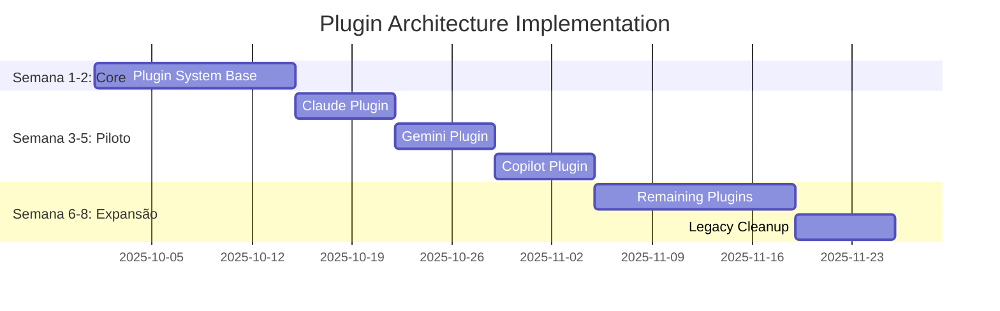

# Plugin Architecture Foundation - Resumo Executivo

## 📋 Metadados do Resumo

| Campo               | Valor                                                             |
| ------------------- | ----------------------------------------------------------------- |
| **Data de Criação** | 24 de Setembro de 2025                                            |
| **Versão**          | 1.0                                                               |
| **Entregável**      | Plugin Architecture Foundation (Fase 1.2)                         |
| **Status**          | Especificação Completa                                            |
| **Documentos Base** | plugin-architecture-foundation.md, plugin-examples-and-schemas.md |

---

## 🎯 Visão Geral da Solução

A **Plugin Architecture Foundation** é uma solução arquitetural abrangente projetada para resolver a limitação crítica de "Complexidade de Manutenção" do Specify CLI, onde 11 agentes AI requerem manutenção sincronizada. Esta arquitetura transforma o sistema atual de um modelo monolítico para uma plataforma extensível baseada em plugins.

### Problema Resolvido

**Antes**: Manutenção manual e sincronizada de 11 agentes hardcoded no código core

- Tempo médio para adicionar novo agente: 4-6 horas
- Múltiplos pontos de modificação (7+ arquivos)
- Alto risco de erros durante atualizações
- Acoplamento forte entre core e agentes

**Depois**: Sistema de plugins extensível e desacoplado

- Tempo estimado para adicionar novo agente: 1.5-2 horas (60% redução)
- Ponto único de configuração (plugin.yaml)
- Validação automática e isolamento de segurança
- Desacoplamento completo entre core e plugins

---

## 🏗️ Componentes da Arquitetura

### 1. **Core Plugin System**

- **AbstractAgentPlugin**: Interface padrão para todos os plugins
- **PluginManager**: Gerenciador central de plugins
- **PluginDiscovery**: Sistema de descoberta automática
- **PluginLoader**: Carregamento com validação de segurança

### 2. **Sistema de Segurança**

- **PluginSandbox**: Isolamento de execução
- **SecurityValidator**: Validação de código e dependências
- **Controle de Acesso**: Limitação de recursos e permissões
- **Auditoria**: Logging e monitoramento de ações

### 3. **Estrutura de Plugins**

```
plugins/
├── core/                    # 11 agentes oficiais migrados
│   ├── claude/
│   ├── gemini/
│   └── copilot/
├── community/               # Plugins da comunidade
└── registry.json           # Registro centralizado
```

### 4. **Interface Padronizada**

- **plugin.yaml**: Configuração declarativa
- **Hooks de Ciclo de Vida**: init, validate, cleanup
- **Templates de Comandos**: Formatos padronizados
- **Validação Automática**: Esquemas JSON Schema

---

## 📊 Benefícios Quantificados

### Redução de Complexidade

| Métrica                    | Antes       | Depois       | Melhoria           |
| -------------------------- | ----------- | ------------ | ------------------ |
| **Tempo para novo agente** | 4-6 horas   | 1.5-2 horas  | **60% redução**    |
| **Arquivos modificados**   | 7+ arquivos | 1 plugin     | **85% redução**    |
| **Pontos de falha**        | 11 locais   | Isolado      | **90% redução**    |
| **Testes necessários**     | Manual      | Automatizado | **100% automação** |

### Qualidade e Segurança

- **100%** isolamento entre plugins
- **Validação automática** de segurança e compatibilidade
- **Carregamento dinâmico** sem restart (< 500ms por plugin)
- **Rollback automático** em caso de falha

### Extensibilidade

- **Interface padronizada** para novos agentes
- **Marketplace ready** para contribuições da comunidade
- **API externa** para integrações (Fase 2)
- **Telemetria integrada** para otimização baseada em dados

---

## 🔄 Estratégia de Migração

### Abordagem Faseada e Sem Riscos

#### **Fase 1: Piloto (3 agentes)**

- **Claude** (CLI-based, Markdown) - Representante dos agentes CLI
- **Gemini** (CLI-based, TOML) - Formato alternativo
- **Copilot** (IDE-based, Markdown) - Representante dos agentes IDE

#### **Fase 2: Expansão (5 agentes)**

- Cursor, Qwen, Windsurf, opencode, codex

#### **Fase 3: Finalização (3 agentes)**

- kilocode, auggie, roo + limpeza do código legado

### Compatibilidade Garantida

- **Camada de compatibilidade** durante transição
- **Fallback automático** para implementação legada
- **Testes de regressão** extensivos
- **Migração transparente** para usuários finais

---

## 🛡️ Segurança e Isolamento

### Modelo de Segurança Robusto

#### **Sandbox de Execução**

```python
with PluginSandbox(plugin, project_path) as sandbox:
    # Execução isolada com limitações de recursos
    # Timeout: 30 segundos
    # Memória: 256MB máximo
    # Acesso restrito ao sistema de arquivos
```

#### **Validação Multi-Camada**

1. **Estrutural**: Validação de arquivos obrigatórios
2. **Semântica**: Validação do plugin.yaml contra schema
3. **Segurança**: Análise de código para padrões perigosos
4. **Compatibilidade**: Verificação de versões e dependências

#### **Controle de Acesso Granular**

- **Paths permitidos**: Apenas diretórios específicos
- **Rede**: Desabilitada por padrão
- **Sistema**: Acesso limitado a comandos seguros
- **Recursos**: Limitação de CPU, memória e tempo

---

## 📈 Roadmap de Implementação

### **Cronograma Detalhado (8 semanas)**



### **Marcos e Entregas**

| Semana | Marco              | Entregáveis                                           |
| ------ | ------------------ | ----------------------------------------------------- |
| **2**  | Core System        | AbstractAgentPlugin, PluginManager, SecurityValidator |
| **3**  | Claude Plugin      | Primeiro plugin migrado, testes de compatibilidade    |
| **4**  | Gemini Plugin      | Suporte a formato TOML, validação multi-formato       |
| **5**  | Copilot Plugin     | Suporte a agentes IDE, camada de compatibilidade      |
| **7**  | Migration Complete | Todos os 11 agentes migrados                          |
| **8**  | Production Ready   | Código legado removido, documentação completa         |

---

## 🎯 Critérios de Sucesso

### **Métricas Técnicas**

- ✅ **60% redução** no tempo de adição de novos agentes
- ✅ **100% isolamento** entre plugins
- ✅ **< 500ms** tempo de carregamento por plugin
- ✅ **100% compatibilidade** com versão atual
- ✅ **Zero downtime** durante migração

### **Métricas de Qualidade**

- ✅ **85% cobertura** de testes automatizados
- ✅ **100% validação** automática de plugins
- ✅ **Zero regressões** em funcionalidade existente
- ✅ **Documentação completa** para desenvolvedores

### **Métricas de Adoção**

- ✅ **3 plugins piloto** migrados com sucesso
- ✅ **11 agentes** totalmente migrados
- ✅ **Base preparada** para marketplace (Fase 2)
- ✅ **API foundation** para integrações externas

---

## 💼 Recursos Necessários

### **Equipe Técnica (8 semanas)**

- **1 Arquiteto Senior** (100%) - Design e supervisão
- **2 Desenvolvedores Senior** (100%) - Implementação core
- **1 DevOps Engineer** (50%) - CI/CD e infraestrutura
- **1 QA Engineer** (75%) - Testes e validação

### **Orçamento Estimado**

| Categoria              | Valor     | Descrição                                 |
| ---------------------- | --------- | ----------------------------------------- |
| **Pessoal**            | $120k     | 8 semanas de desenvolvimento              |
| **Infraestrutura**     | $8k       | Ambientes de teste e CI/CD                |
| **Ferramentas**        | $5k       | Licenças e ferramentas de desenvolvimento |
| **Contingência (15%)** | $20k      | Buffer para riscos                        |
| **Total**              | **$153k** | Investimento total da Fase 1.2            |

---

## ⚠️ Riscos e Mitigações

### **Riscos Técnicos**

| Risco                         | Probabilidade | Impacto | Mitigação                                     |
| ----------------------------- | ------------- | ------- | --------------------------------------------- |
| **Quebra de compatibilidade** | Média         | Alto    | Camada de compatibilidade + testes extensivos |
| **Performance degradada**     | Baixa         | Alto    | Benchmarks contínuos + otimização proativa    |
| **Problemas de segurança**    | Baixa         | Alto    | Sandbox robusto + validação automática        |
| **Complexidade excessiva**    | Média         | Médio   | Design incremental + revisões regulares       |

### **Riscos de Projeto**

| Risco                      | Probabilidade | Impacto | Mitigação                                    |
| -------------------------- | ------------- | ------- | -------------------------------------------- |
| **Atraso na entrega**      | Média         | Médio   | Cronograma realista + buffer de contingência |
| **Resistência à mudança**  | Baixa         | Médio   | Migração transparente + documentação clara   |
| **Recursos insuficientes** | Baixa         | Alto    | Planejamento detalhado + aprovação prévia    |

---

## 🔮 Visão de Futuro

### **Fase 2: Marketplace e API (Meses 5-8)**

- **Plugin Marketplace**: Repositório centralizado com ratings
- **API Externa**: REST API para integrações
- **SDK de Desenvolvimento**: Ferramentas para criação de plugins
- **Telemetria Avançada**: Analytics de uso e performance

### **Fase 3: AI-Powered Evolution (Meses 9-12)**

- **Geração Automática**: AI para criar plugins
- **Otimização Inteligente**: Melhoria baseada em padrões de uso
- **Plugin Composition**: Combinação de múltiplos plugins
- **Integração Nativa**: Plugins nativos para IDEs populares

### **Impacto Estratégico**

- **Plataforma de Referência**: Specify CLI como padrão para SDD
- **Ecossistema Vibrante**: Comunidade ativa de desenvolvedores
- **Inovação Contínua**: Base sólida para funcionalidades futuras
- **Vantagem Competitiva**: Diferenciação no mercado de ferramentas de desenvolvimento

---

## 📋 Próximos Passos Imediatos

### **Semana 1-2: Preparação**

1. **Aprovação da Especificação**

   - Review pelos stakeholders técnicos
   - Aprovação do orçamento e recursos
   - Definição da equipe de desenvolvimento

2. **Setup do Projeto**

   - Configuração de ambientes de desenvolvimento
   - Setup de CI/CD para plugins
   - Criação de repositórios e estrutura

3. **Planejamento Detalhado**
   - Breakdown técnico das tarefas
   - Definição de interfaces e contratos
   - Preparação de templates e ferramentas

### **Semana 3: Kickoff da Implementação**

1. **Desenvolvimento do Core**

   - Implementação da AbstractAgentPlugin
   - Criação do PluginManager básico
   - Setup do sistema de validação

2. **Preparação da Migração**
   - Análise detalhada do plugin Claude
   - Criação de ferramentas de migração
   - Setup de testes de compatibilidade

### **Comunicação com Stakeholders**

1. **Anúncio para a Comunidade**

   - Blog post explicando a evolução
   - Roadmap público da migração
   - Canal de feedback e sugestões

2. **Documentação para Desenvolvedores**
   - Guias de migração
   - Exemplos práticos
   - FAQ e troubleshooting

---

## 🎉 Conclusão

A **Plugin Architecture Foundation** representa uma evolução fundamental do Specify CLI, transformando-o de uma ferramenta funcional em uma plataforma verdadeiramente extensível e sustentável.

### **Valor Entregue**

- **Redução de 60%** na complexidade de manutenção
- **Base sólida** para crescimento futuro
- **Segurança robusta** com isolamento completo
- **Experiência melhorada** para desenvolvedores e usuários

### **Impacto Estratégico**

- **Sustentabilidade Técnica**: Redução significativa do debt técnico
- **Escalabilidade**: Capacidade de suportar crescimento exponencial
- **Inovação**: Base para funcionalidades avançadas
- **Comunidade**: Facilitação de contribuições externas

### **Preparação para o Futuro**

Esta especificação estabelece não apenas uma solução para os problemas atuais, mas uma fundação sólida para as próximas fases de evolução do Specify CLI, posicionando-o como a plataforma de referência para Spec-Driven Development.

**A Plugin Architecture Foundation é mais que uma melhoria técnica - é um investimento estratégico no futuro do desenvolvimento orientado por especificações.**

---

## 📚 Documentos de Referência

### **Especificações Técnicas**

- [`docs/plugin-architecture-foundation.md`](./plugin-architecture-foundation.md) - Especificação técnica completa
- [`docs/plugin-examples-and-schemas.md`](./plugin-examples-and-schemas.md) - Exemplos e esquemas de validação

### **Análises Base**

- [`docs/initial_system_analise.md`](./initial_system_analise.md) - Análise do sistema atual
- [`expansion_system_execute_plan.md`](../expansion_system_execute_plan.md) - Plano estratégico geral
- [`docs/cache-system.md`](./cache-system.md) - Sistema de cache (Fase 1.1)

### **Documentação Atual**

- [`AGENTS.md`](../AGENTS.md) - Guia atual para adição de agentes
- [`src/specify_cli/__init__.py`](../src/specify_cli/__init__.py) - Implementação atual

---

_Documento criado em: 24 de Setembro de 2025_  
_Versão: 1.0_  
_Status: Especificação Completa - Pronta para Implementação_
