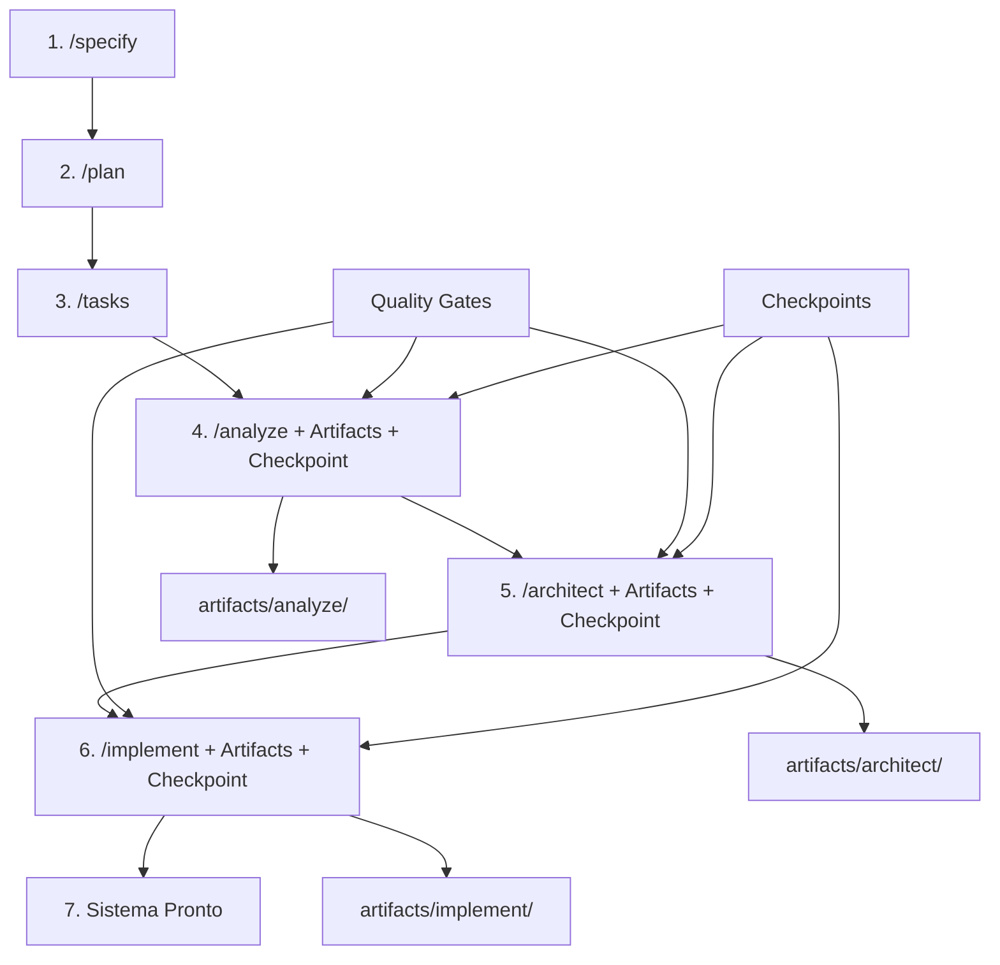

# Guia de Workflow SDD v2.0 - Para Usuários

**Versão**: 2.0  
**Data**: 2025-09-24  
**Objetivo**: Guia prático do workflow Spec-Driven Development com sistemas críticos integrados

## 🎯 Visão Geral

O **SDD v2.0** integra 3 sistemas críticos que automatizam a geração de artefatos, validação de qualidade e controle de checkpoints, proporcionando um workflow robusto e rastreável.

## 🚀 Workflow Completo SDD v2.0

### Fluxo Recomendado



## 📋 Passo a Passo Detalhado

### **Passo 1: Especificação** `/specify`

#### Comando

```bash
/specify "Criar sistema de autenticação de usuários"
```

#### O que acontece

- Cria especificação inicial do projeto
- Define requisitos funcionais e não-funcionais
- Estabelece critérios de aceitação

#### Artefatos gerados

- `spec.md` - Especificação completa do projeto

---

### **Passo 2: Planejamento** `/plan`

#### Comando

```bash
/plan "Implementar autenticação JWT com banco PostgreSQL"
```

#### O que acontece

- Analisa a especificação
- Define arquitetura e stack tecnológico
- Cria plano de implementação detalhado

#### Artefatos gerados

- `plan.md` - Plano de implementação
- `data-model.md` - Modelo de dados
- `contracts/` - Contratos de API
- `research.md` - Decisões técnicas
- `quickstart.md` - Cenários de teste

---

### **Passo 3: Tarefas** `/tasks`

#### Comando

```bash
/tasks
```

#### O que acontece

- Analisa o plano de implementação
- Gera lista detalhada de tarefas
- Define dependências e ordem de execução

#### Artefatos gerados

- `tasks.md` - Lista completa de tarefas numeradas

---

### **Passo 4: Análise** `/analyze` ⭐ **NOVO SDD v2.0**

#### Comando

```bash
/analyze
```

#### O que acontece automaticamente

1. **🔄 Geração de Artefatos Ricos** (automática):

   ```bash
   # Sistema gera automaticamente:
   generate_phase_artifacts "analyze" "shared-principles"
   ```

2. **🧠 Integração Knowledge-Base** (automática):

   - Consulta padrões arquiteturais
   - Valida conformidade com KB
   - Gera relatórios de compliance

3. **✅ Quality Gate** (automático):

   - Valida artefatos obrigatórios
   - Verifica conformidade KB
   - Avalia métricas de qualidade

4. **📸 Checkpoint** (automático se aprovado):
   - Cria snapshot do estado atual
   - Registra checkpoint para rollback
   - Gera relatórios de checkpoint

#### 📁 Artefatos que você verá

```
artifacts/analyze/
├── architecture_assessment.md      # Avaliação arquitetural completa
├── technical_debt_report.md        # Relatório de débito técnico
├── compliance_check.json           # Verificação de conformidade KB
└── knowledge_base_references.md    # Referências KB aplicadas
```

#### 🎯 Checkpoint Criado

- **Nome**: `analyze_complete`
- **Snapshot**: Estado completo preservado
- **Status**: ✅ PASS / ❌ FAIL
- **Rollback**: Disponível se necessário

---

### **Passo 5: Arquitetura** `/architect` ⭐ **NOVO SDD v2.0**

#### Comando

```bash
/architect "Definir arquitetura do sistema de autenticação"
```

#### O que acontece automaticamente

1. **🔄 Geração de Artefatos Ricos** (automática):

   ```bash
   # Sistema gera automaticamente:
   generate_phase_artifacts "architect" "shared-principles"
   ```

2. **🧠 Integração Knowledge-Base** (automática):

   - Consulta padrões de design
   - Valida decisões arquiteturais
   - Aplica best practices

3. **✅ Quality Gate** (automático):

   - Valida documentos de design
   - Verifica consistência de padrões
   - Avalia dependências

4. **📸 Checkpoint** (automático se aprovado):
   - Preserva decisões arquiteturais
   - Registra ADRs (Architecture Decision Records)
   - Cria ponto de rollback

#### 📁 Artefatos que você verá

```
artifacts/architect/
├── architecture_decision_record.md    # ADRs com decisões documentadas
├── system_design_document.md          # Documento de design do sistema
├── component_interaction_diagram.mmd  # Diagrama de interação (Mermaid)
└── validation_report.md               # Relatório de validação arquitetural
```

#### 🎯 Checkpoint Criado

- **Nome**: `architect_complete`
- **Snapshot**: Decisões arquiteturais preservadas
- **Rollback**: Para `analyze_complete` se necessário

---

### **Passo 6: Implementação** `/implement` ⭐ **NOVO SDD v2.0**

#### Comando

```bash
/implement "Implementar sistema de autenticação conforme especificado"
```

#### O que acontece automaticamente

1. **🔄 Geração de Artefatos Ricos** (automática):

   ```bash
   # Sistema gera automaticamente:
   generate_phase_artifacts "implement" "shared-principles"
   ```

2. **🧠 Integração Knowledge-Base** (automática):

   - Aplica padrões de codificação
   - Valida qualidade do código
   - Verifica conformidade

3. **✅ Quality Gate** (automático):

   - Valida qualidade do código
   - Verifica cobertura de testes
   - Avalia performance

4. **📸 Checkpoint Final** (automático se aprovado):
   - Preserva implementação completa
   - Marca sistema pronto para produção
   - Cria snapshot final

#### 📁 Artefatos que você verá

```
artifacts/implement/
├── code_quality_report.md          # Relatório de qualidade do código
├── test_coverage_report.html       # Relatório de cobertura de testes
├── performance_benchmarks.md       # Benchmarks de performance
└── api_documentation.md            # Documentação completa da API
```

#### 🎯 Checkpoint Final

- **Nome**: `implement_complete`
- **Status**: ✅ PRONTO PARA PRODUÇÃO
- **Rollback**: Para `architect_complete` se necessário

---

## 🔧 Ferramentas de Controle

### Dashboard de Checkpoints

```bash
# Ver status completo do sistema
./scripts/bash/checkpoint-control.sh dashboard
```

**O que você verá**:

```
╔══════════════════════════════════════════════════════════════╗
║                    CHECKPOINT DASHBOARD                     ║
║                     SDD v2.0 System                         ║
╚══════════════════════════════════════════════════════════════╝

🔧 System Status:
  ✅ Checkpoint System: AVAILABLE
  ✅ Artifact System: AVAILABLE
  ✅ Knowledge Base: AVAILABLE
  📊 Total Checkpoints: 3
  💾 Snapshots Storage: 150K

📋 Recent Checkpoints:
  analyze_complete - analyze (PASS)
  architect_complete - architect (PASS)
  implement_complete - implement (PASS)
```

### Métricas de Qualidade

```bash
# Gerar relatório de métricas
./scripts/bash/checkpoint-control.sh metrics
```

**O que você verá**:

```json
{
  "total_artifacts": 16,
  "total_checkpoints": 3,
  "system_health": "healthy",
  "phases": {
    "analyze": { "artifacts_count": 4, "kb_compliance": "high" },
    "architect": { "artifacts_count": 4, "quality_gate_status": "pass" },
    "implement": { "artifacts_count": 4, "quality_gate_status": "pass" }
  }
}
```

### Rollback (Se Necessário)

```bash
# Listar checkpoints disponíveis
./scripts/bash/checkpoint-system.sh list

# Fazer rollback para checkpoint específico
./scripts/bash/checkpoint-system.sh rollback architect_complete
```

## 📊 Estrutura Final de Artefatos

### Após Workflow Completo

```
projeto/
├── spec.md                          # Especificação original
├── plan.md                          # Plano de implementação
├── tasks.md                         # Lista de tarefas
├── artifacts/                       # ⭐ NOVO - Artefatos ricos
│   ├── analyze/                     # 4 artefatos de análise
│   │   ├── architecture_assessment.md
│   │   ├── technical_debt_report.md
│   │   ├── compliance_check.json
│   │   └── knowledge_base_references.md
│   ├── architect/                   # 4 artefatos de arquitetura
│   │   ├── architecture_decision_record.md
│   │   ├── system_design_document.md
│   │   ├── component_interaction_diagram.mmd
│   │   └── validation_report.md
│   ├── implement/                   # 4 artefatos de implementação
│   │   ├── code_quality_report.md
│   │   ├── test_coverage_report.html
│   │   ├── performance_benchmarks.md
│   │   └── api_documentation.md
│   └── checkpoints/                 # 4 artefatos de checkpoint
│       ├── quality_gate_results.json
│       ├── compliance_audit.md
│       ├── rollback_snapshot.json
│       └── checkpoint_summary.md
└── .specify-cache/                  # ⭐ NOVO - Sistema de controle
    ├── checkpoints/                 # Checkpoints criados
    ├── snapshots/                   # Snapshots para rollback
    ├── quality-gates/               # Resultados de quality gates
    ├── compliance-reports/          # Relatórios de conformidade KB
    └── traceability/                # Rastreabilidade completa
```

## 🎯 Benefícios para o Usuário

### Durante o Desenvolvimento

1. **📊 Visibilidade Total**

   - 16 artefatos estruturados por projeto
   - Métricas de qualidade em tempo real
   - Status de conformidade automático

2. **🛡️ Qualidade Garantida**

   - Validação automática entre fases
   - Conformidade com Knowledge Base
   - Prevenção de problemas

3. **🔄 Segurança de Rollback**
   - Checkpoints automáticos
   - Rollback em caso de problemas
   - Estado sempre preservado

### Após o Desenvolvimento

1. **📚 Documentação Completa**

   - API documentation automática
   - Relatórios de qualidade
   - Decisões arquiteturais documentadas

2. **🔍 Auditoria e Compliance**

   - Rastreabilidade completa
   - Conformidade com padrões
   - Histórico de decisões

3. **🚀 Pronto para Produção**
   - Quality gates aprovados
   - Métricas validadas
   - Sistema testado e documentado

## 🚨 Cenários de Problema

### Se Quality Gate Falhar

```bash
# Exemplo: Quality gate falha na fase architect
❌ Quality gate failed - architecture requires remediation

# O sistema automaticamente:
1. Mostra detalhes do problema
2. Lista checkpoints disponíveis para rollback
3. Preserva estado atual como backup
4. Oferece opções de recuperação
```

### Opções de Recuperação

1. **🔧 Corrigir e Continuar**

   - Resolver problemas identificados
   - Re-executar o command
   - Quality gate será validado novamente

2. **🔄 Rollback**

   ```bash
   ./scripts/bash/checkpoint-system.sh rollback analyze_complete
   ```

   - Volta para checkpoint anterior
   - Estado atual preservado como backup
   - Pode recomeçar da fase anterior

3. **📊 Diagnóstico**
   ```bash
   ./scripts/bash/checkpoint-control.sh dashboard
   ```
   - Ver status completo do sistema
   - Identificar problemas específicos
   - Acessar métricas detalhadas

## 💡 Dicas de Uso

### Para Máxima Eficiência

1. **📝 Especificações Claras**

   - Seja específico no `/specify`
   - Inclua requisitos não-funcionais
   - Defina critérios de aceitação

2. **🎯 Planejamento Detalhado**

   - Use `/plan` com contexto técnico
   - Especifique stack tecnológico
   - Inclua constraints e dependências

3. **🔍 Análise Cuidadosa**

   - Revise os artefatos gerados em `artifacts/analyze/`
   - Verifique compliance no `compliance_check.json`
   - Consulte referências KB em `knowledge_base_references.md`

4. **🏗️ Arquitetura Validada**

   - Revise ADRs em `architecture_decision_record.md`
   - Valide design em `system_design_document.md`
   - Verifique diagramas em `component_interaction_diagram.mmd`

5. **⚡ Implementação Monitorada**
   - Acompanhe qualidade em `code_quality_report.md`
   - Verifique testes em `test_coverage_report.html`
   - Monitore performance em `performance_benchmarks.md`

### Para Troubleshooting

1. **📊 Use o Dashboard**

   ```bash
   ./scripts/bash/checkpoint-control.sh dashboard
   ```

2. **🔍 Verifique Métricas**

   ```bash
   ./scripts/bash/checkpoint-control.sh metrics
   ```

3. **📋 Liste Checkpoints**

   ```bash
   ./scripts/bash/checkpoint-system.sh list
   ```

4. **🔄 Rollback se Necessário**
   ```bash
   ./scripts/bash/checkpoint-system.sh rollback <checkpoint_id>
   ```

## 📈 O que Esperar

### Performance

- **⚡ Geração de Artefatos**: < 10s por fase
- **📸 Criação de Checkpoint**: < 5s
- **🔄 Rollback**: < 15s
- **📊 Métricas**: Tempo real

### Qualidade

- **📚 16 Artefatos Estruturados**: Por projeto
- **🧠 100% Conformidade KB**: Validação automática
- **✅ Quality Gates**: Validação obrigatória
- **📊 Rastreabilidade**: Completa e versionada

### Experiência do Usuário

- **🎯 Workflow Transparente**: Funciona como antes, mas com mais qualidade
- **📊 Visibilidade Total**: Artefatos e métricas sempre disponíveis
- **🛡️ Segurança**: Rollback automático em problemas
- **📚 Documentação**: Gerada automaticamente

---

## ✅ Resumo

O **SDD v2.0** mantém a simplicidade do workflow original, mas adiciona:

- **🔄 Artefatos Ricos**: 16 documentos estruturados por projeto
- **🧠 Knowledge Base**: Validação automática de conformidade
- **✅ Quality Gates**: Validação obrigatória entre fases
- **📸 Checkpoints**: Rollback automático em problemas
- **📊 Métricas**: Visibilidade total da qualidade

**Resultado**: Projetos de maior qualidade, melhor documentados e com rastreabilidade completa, mantendo a facilidade de uso.

---

_Guia de usuário para o workflow SDD v2.0 com sistemas críticos integrados_
