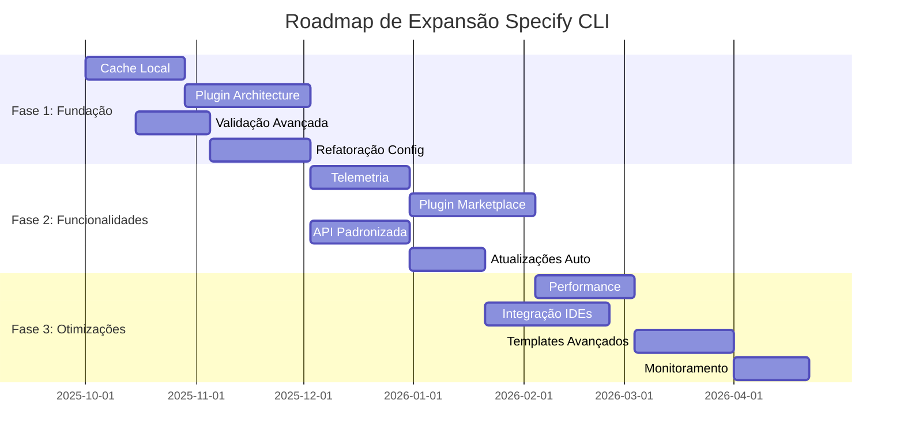

# Plano Estratégico de Expansão e Melhoria - Specify CLI

## 📋 Metadados do Plano

| Campo                  | Valor                                      |
| ---------------------- | ------------------------------------------ |
| **Data de Criação**    | 24 de Setembro de 2025                     |
| **Versão do Plano**    | 1.0                                        |
| **Escopo**             | Expansão e melhoria do fluxo de agentes AI |
| **Horizonte Temporal** | 12-18 meses                                |
| **Baseado na Análise** | docs/initial_system_analise.md             |

---

## 🎯 Visão Geral do Plano

O Specify CLI demonstra uma arquitetura sólida para suporte multi-agente em Spec-Driven Development, mas enfrenta desafios de escalabilidade e manutenibilidade com o crescimento para 11 agentes diferentes. Este plano estratégico visa transformar o sistema atual em uma plataforma mais robusta, extensível e sustentável.

### Contexto Atual

- ✅ **11 agentes AI suportados** com arquitetura funcional
- ✅ **Processo SDD bem estruturado** e documentado
- ✅ **Multiplataforma** (Windows, Linux, macOS)
- ⚠️ **Complexidade de manutenção** crescente
- ⚠️ **Dependência de conectividade** obrigatória
- ⚠️ **Fragmentação de configuração** entre agentes

### Visão Estratégica

Evoluir o Specify CLI de uma ferramenta de bootstrapping para uma **plataforma extensível de desenvolvimento orientado por especificações**, mantendo a simplicidade de uso enquanto resolve limitações arquiteturais fundamentais.

---

## 🎯 Objetivos Estratégicos

### 1. **Sustentabilidade Técnica**

- Reduzir complexidade de manutenção de 11 agentes
- Implementar arquitetura de plugins extensível
- Automatizar processos de integração de novos agentes

### 2. **Experiência do Usuário**

- Suporte offline robusto com cache inteligente
- Validação avançada de ferramentas e compatibilidade
- Interface unificada independente do agente escolhido

### 3. **Escalabilidade e Extensibilidade**

- Sistema de plugins para contribuições da comunidade
- API padronizada para integração de agentes
- Telemetria para otimização baseada em dados

### 4. **Robustez Operacional**

- Health checks automatizados
- Recuperação inteligente de falhas
- Monitoramento proativo de compatibilidade

---

## 🚀 Fases de Implementação

### **FASE 1: Fundação e Infraestrutura** (Meses 1-4)

#### Objetivos da Fase

- Estabelecer base arquitetural sólida
- Resolver limitações críticas atuais
- Manter compatibilidade com versão existente

#### Entregáveis Principais

**1.1 Sistema de Cache Local**

- **Descrição**: Cache inteligente de templates com sincronização
- **Benefícios**: Suporte offline, redução de dependência de rede
- **Esforço**: 3-4 semanas
- **Critérios de Aceitação**:
  - Cache automático de templates baixados
  - Modo offline funcional
  - Sincronização inteligente com GitHub
  - Invalidação automática de cache obsoleto

**1.2 Plugin Architecture Foundation**

- **Descrição**: Base do sistema de plugins para agentes
- **Benefícios**: Redução de acoplamento, facilita manutenção
- **Esforço**: 4-5 semanas
- **Critérios de Aceitação**:
  - Interface padronizada para plugins de agentes
  - Carregamento dinâmico de plugins
  - Isolamento entre plugins
  - Migração de 3 agentes existentes para o novo sistema

**1.3 Validação Avançada de Ferramentas**

- **Descrição**: Sistema robusto de verificação de versões e compatibilidade
- **Benefícios**: Detecção precoce de incompatibilidades
- **Esforço**: 2-3 semanas
- **Critérios de Aceitação**:
  - Verificação de versões mínimas
  - Testes de compatibilidade automatizados
  - Sugestões de resolução para problemas detectados
  - Health checks periódicos

**1.4 Refatoração de Configuração**

- **Descrição**: Unificação de formatos de configuração
- **Benefícios**: Redução de fragmentação, manutenção simplificada
- **Esforço**: 3-4 semanas
- **Critérios de Aceitação**:
  - Formato de configuração unificado
  - Migração automática de configurações existentes
  - Validação de esquemas de configuração
  - Documentação atualizada

#### Dependências da Fase 1

- Nenhuma dependência externa crítica
- Requer coordenação com equipe de manutenção atual

#### Riscos da Fase 1

- **Risco**: Quebra de compatibilidade com versões existentes
- **Mitigação**: Testes extensivos de regressão, migração gradual

---

### **FASE 2: Funcionalidades Avançadas** (Meses 5-8)

#### Objetivos da Fase

- Implementar funcionalidades que agregam valor significativo
- Expandir capacidades de monitoramento e otimização
- Melhorar experiência de desenvolvimento

#### Entregáveis Principais

**2.1 Sistema de Telemetria e Métricas**

- **Descrição**: Coleta de métricas de uso e performance
- **Benefícios**: Otimização baseada em dados, identificação de padrões
- **Esforço**: 3-4 semanas
- **Critérios de Aceitação**:
  - Coleta de métricas de uso por agente
  - Dashboard de analytics
  - Identificação de padrões de falha
  - Relatórios de performance
  - Compliance com GDPR/privacidade

**2.2 Plugin Marketplace**

- **Descrição**: Repositório centralizado de plugins de agentes
- **Benefícios**: Facilita contribuições da comunidade
- **Esforço**: 4-5 semanas
- **Critérios de Aceitação**:
  - Repositório de plugins com versionamento
  - Sistema de avaliação e reviews
  - Instalação automática de plugins
  - Verificação de segurança de plugins

**2.3 API de Integração Padronizada**

- **Descrição**: API consistente para integração de novos agentes
- **Benefícios**: Simplifica adição de novos agentes
- **Esforço**: 3-4 semanas
- **Critérios de Aceitação**:
  - API REST para operações de agentes
  - SDK para desenvolvimento de plugins
  - Documentação completa da API
  - Exemplos de implementação

**2.4 Sistema de Atualizações Inteligentes**

- **Descrição**: Atualizações automáticas com rollback
- **Benefícios**: Manutenção simplificada, redução de problemas
- **Esforço**: 2-3 semanas
- **Critérios de Aceitação**:
  - Atualizações automáticas opcionais
  - Sistema de rollback automático
  - Notificações de atualizações disponíveis
  - Testes de compatibilidade pré-atualização

#### Dependências da Fase 2

- Conclusão da Fase 1 (especialmente Plugin Architecture)
- Infraestrutura de hosting para marketplace

#### Riscos da Fase 2

- **Risco**: Complexidade excessiva do marketplace
- **Mitigação**: MVP inicial, iteração baseada em feedback

---

### **FASE 3: Otimizações e Expansões** (Meses 9-12)

#### Objetivos da Fase

- Otimizar performance e experiência do usuário
- Expandir ecossistema e integrações
- Preparar para crescimento futuro

#### Entregáveis Principais

**3.1 Otimização de Performance**

- **Descrição**: Melhorias de velocidade e eficiência
- **Benefícios**: Experiência mais fluida, menor uso de recursos
- **Esforço**: 3-4 semanas
- **Critérios de Aceitação**:
  - Redução de 50% no tempo de inicialização
  - Cache inteligente de operações frequentes
  - Paralelização de downloads
  - Otimização de uso de memória

**3.2 Integração com IDEs**

- **Descrição**: Plugins nativos para IDEs populares
- **Benefícios**: Workflow mais integrado
- **Esforço**: 4-5 semanas
- **Critérios de Aceitação**:
  - Plugin para VS Code
  - Plugin para JetBrains IDEs
  - Integração com Cursor nativo
  - Comandos contextuais nos IDEs

**3.3 Sistema de Templates Avançado**

- **Descrição**: Templates customizáveis e versionados
- **Benefícios**: Maior flexibilidade, reutilização
- **Esforço**: 3-4 semanas
- **Critérios de Aceitação**:
  - Templates customizáveis por organização
  - Versionamento de templates
  - Herança e composição de templates
  - Validação de templates

**3.4 Monitoramento e Alertas**

- **Descrição**: Sistema proativo de monitoramento
- **Benefícios**: Detecção precoce de problemas
- **Esforço**: 2-3 semanas
- **Critérios de Aceitação**:
  - Monitoramento de saúde do sistema
  - Alertas automáticos para administradores
  - Dashboard de status em tempo real
  - Integração com ferramentas de monitoramento

#### Dependências da Fase 3

- Conclusão das Fases 1 e 2
- Feedback da comunidade das fases anteriores

#### Riscos da Fase 3

- **Risco**: Scope creep com muitas funcionalidades
- **Mitigação**: Priorização rigorosa baseada em métricas da Fase 2

---

## 📅 Roadmap Temporal

### Marcos Principais

| Marco  | Data Estimada | Descrição                                       |
| ------ | ------------- | ----------------------------------------------- |
| **M1** | Janeiro 2026  | Conclusão da Fase 1 - Base sólida estabelecida  |
| **M2** | Maio 2026     | Conclusão da Fase 2 - Funcionalidades avançadas |
| **M3** | Setembro 2026 | Conclusão da Fase 3 - Sistema otimizado         |
| **M4** | Dezembro 2026 | Avaliação e planejamento da próxima iteração    |

---

## 📊 Critérios de Sucesso

### Métricas Quantitativas

#### Fase 1

- **Redução de Complexidade**: 60% redução no tempo de adição de novos agentes
- **Suporte Offline**: 95% das operações funcionam offline após cache inicial
- **Compatibilidade**: 100% compatibilidade com versões existentes
- **Performance**: Tempo de inicialização mantido ou melhorado

#### Fase 2

- **Adoção de Plugins**: 5+ plugins da comunidade no marketplace
- **Telemetria**: Cobertura de 90% das operações principais
- **API Usage**: 3+ integrações externas usando a API
- **Atualizações**: 95% de sucesso em atualizações automáticas

#### Fase 3

- **Performance**: 50% melhoria no tempo de inicialização
- **Integração IDE**: Suporte para 3+ IDEs principais
- **Templates**: 10+ templates customizados em uso
- **Monitoramento**: 99.9% uptime do sistema de monitoramento

### Métricas Qualitativas

- **Satisfação do Usuário**: Score NPS > 50
- **Facilidade de Manutenção**: Redução significativa em issues de manutenção
- **Contribuições da Comunidade**: Aumento em PRs e contribuições
- **Documentação**: Cobertura completa e atualizada

---

## ⚠️ Riscos e Mitigações

### Riscos Técnicos

| Risco                         | Probabilidade | Impacto | Mitigação                                                    |
| ----------------------------- | ------------- | ------- | ------------------------------------------------------------ |
| **Quebra de Compatibilidade** | Média         | Alto    | Testes extensivos, migração gradual, versionamento semântico |
| **Complexidade Excessiva**    | Alta          | Médio   | Design incremental, revisões arquiteturais regulares         |
| **Performance Degradada**     | Baixa         | Alto    | Benchmarks contínuos, otimização proativa                    |
| **Problemas de Segurança**    | Baixa         | Alto    | Auditorias de segurança, sandboxing de plugins               |

### Riscos de Projeto

| Risco                      | Probabilidade | Impacto | Mitigação                                     |
| -------------------------- | ------------- | ------- | --------------------------------------------- |
| **Recursos Insuficientes** | Média         | Alto    | Planejamento realista, priorização clara      |
| **Mudanças de Requisitos** | Alta          | Médio   | Desenvolvimento ágil, feedback contínuo       |
| **Dependências Externas**  | Média         | Médio   | Identificação precoce, planos de contingência |
| **Adoção Lenta**           | Baixa         | Médio   | Comunicação clara, migração assistida         |

### Estratégias de Mitigação Gerais

1. **Desenvolvimento Incremental**: Entregas pequenas e frequentes
2. **Testes Automatizados**: Cobertura abrangente de testes
3. **Feedback Contínuo**: Envolvimento da comunidade
4. **Documentação Viva**: Manutenção contínua da documentação
5. **Monitoramento Proativo**: Detecção precoce de problemas

---

## 💼 Recursos Necessários

### Equipe Técnica

#### Fase 1 (4 meses)

- **1 Arquiteto Senior** (100%) - Design e supervisão técnica
- **2 Desenvolvedores Senior** (100%) - Implementação core
- **1 DevOps Engineer** (50%) - Infraestrutura e CI/CD
- **1 QA Engineer** (75%) - Testes e validação

#### Fase 2 (4 meses)

- **1 Arquiteto Senior** (75%) - Supervisão e design de APIs
- **3 Desenvolvedores Senior** (100%) - Implementação de funcionalidades
- **1 Frontend Developer** (100%) - Dashboard e marketplace UI
- **1 DevOps Engineer** (75%) - Infraestrutura de marketplace
- **1 QA Engineer** (100%) - Testes extensivos

#### Fase 3 (4 meses)

- **1 Arquiteto Senior** (50%) - Otimizações e supervisão
- **2 Desenvolvedores Senior** (100%) - Implementação e otimizações
- **1 Performance Engineer** (100%) - Otimizações específicas
- **1 DevOps Engineer** (50%) - Monitoramento e alertas
- **1 QA Engineer** (75%) - Testes de performance

### Infraestrutura

#### Desenvolvimento

- **Ambientes de Teste**: 3 ambientes (dev, staging, prod)
- **CI/CD Pipeline**: GitHub Actions expandido
- **Monitoramento**: Ferramentas de APM e logging
- **Repositórios**: Estrutura multi-repo para plugins

#### Produção

- **Marketplace Hosting**: Infraestrutura cloud escalável
- **CDN**: Distribuição global de templates
- **Analytics**: Plataforma de telemetria
- **Backup**: Sistema robusto de backup e recovery

### Orçamento Estimado

| Categoria              | Fase 1 | Fase 2 | Fase 3 | Total       |
| ---------------------- | ------ | ------ | ------ | ----------- |
| **Pessoal**            | $240k  | $320k  | $280k  | $840k       |
| **Infraestrutura**     | $15k   | $25k   | $20k   | $60k        |
| **Ferramentas**        | $10k   | $15k   | $10k   | $35k        |
| **Contingência (15%)** | $40k   | $54k   | $47k   | $141k       |
| **Total**              | $305k  | $414k  | $357k  | **$1.076k** |

---

## 🔄 Considerações de Migração

### Compatibilidade com Versões Existentes

#### Estratégia de Migração

1. **Versionamento Semântico**: Adoção rigorosa do SemVer
2. **Período de Transição**: 6 meses de suporte dual
3. **Migração Assistida**: Ferramentas automáticas de migração
4. **Documentação**: Guias detalhados de migração

#### Plano de Comunicação

- **Anúncios Antecipados**: 3 meses antes de mudanças breaking
- **Canais Múltiplos**: GitHub, documentação, newsletter
- **Suporte Direto**: Canal dedicado para questões de migração
- **Workshops**: Sessões de migração assistida

### Testes e Validação

#### Estratégia de Testes

- **Testes de Regressão**: Suite completa para cada release
- **Testes de Integração**: Validação com todos os agentes
- **Testes de Performance**: Benchmarks contínuos
- **Testes de Usuário**: Beta testing com usuários reais

#### Critérios de Qualidade

- **Cobertura de Código**: Mínimo 85%
- **Testes E2E**: Cobertura de workflows principais
- **Performance**: Sem degradação em operações críticas
- **Compatibilidade**: 100% com versões suportadas

---

## 📈 Próximos Passos

### Imediatos (Próximas 2 semanas)

1. **Aprovação do Plano**: Review e aprovação pelos stakeholders
2. **Formação da Equipe**: Recrutamento e alocação de recursos
3. **Setup Inicial**: Configuração de ambientes e ferramentas
4. **Planejamento Detalhado**: Breakdown detalhado da Fase 1

### Curto Prazo (Próximo mês)

1. **Início da Fase 1**: Kickoff oficial do projeto
2. **Prototipagem**: POCs para validação de conceitos
3. **Arquitetura Detalhada**: Design detalhado dos componentes
4. **Comunicação**: Anúncio para a comunidade

### Médio Prazo (Próximos 3 meses)

1. **Desenvolvimento Ativo**: Implementação dos primeiros entregáveis
2. **Feedback Loop**: Coleta de feedback da comunidade
3. **Ajustes**: Refinamento baseado em aprendizados
4. **Preparação Fase 2**: Planejamento detalhado da próxima fase

---

## 🎯 Conclusão

Este plano estratégico representa uma evolução natural do Specify CLI, transformando-o de uma ferramenta funcional em uma plataforma robusta e extensível. A abordagem faseada permite:

- **Redução de Riscos**: Implementação incremental com validação contínua
- **Manutenção de Momentum**: Entregas regulares mantêm engajamento
- **Flexibilidade**: Capacidade de ajustar baseado em feedback
- **Sustentabilidade**: Base sólida para crescimento futuro

### Benefícios Esperados

- **Para Usuários**: Experiência mais fluida e confiável
- **Para Mantenedores**: Redução significativa na complexidade de manutenção
- **Para Comunidade**: Maior facilidade para contribuir e estender
- **Para Organização**: Plataforma escalável para crescimento futuro

### Fatores Críticos de Sucesso

1. **Comprometimento da Liderança**: Suporte consistente ao longo do projeto
2. **Qualidade da Execução**: Foco em excelência técnica
3. **Engajamento da Comunidade**: Feedback e contribuições ativas
4. **Flexibilidade**: Capacidade de adaptar baseado em aprendizados

O sucesso deste plano posicionará o Specify CLI como a plataforma de referência para Spec-Driven Development, estabelecendo uma base sólida para inovação contínua e crescimento sustentável.

---

_Documento criado em: 24 de Setembro de 2025_  
_Versão: 1.0_  
_Próxima revisão: 24 de Dezembro de 2025_
